# Construct 3

---

[TOC]

## O que é?

* **Construct 3** é uma ferramenta para a criação de jogos **2D**  voltada para **não programadores** 
* A versão 3 do Construct é baseada na plataforma web, ou seja, nada precisa ser baixado ou instalado no computador, o acesso pode ser feito por um *browser* atualizado como Google Chome, Mozila Firefox, Opera, Safari etc.
* Foi desenvolvido pela **Scirra Ltda** e a primeira versão foi lançada em 2007
* Permite a criação rápida de jogos por meio do sistema ***drag-and-drop*** (arrastar e soltar)
* No Construct entender a **lógica** de como um jogo funciona é **mais importante** do que saber alguma linguagem de programação já que o código do jogo é feito de forma **visual** por meio de **blocos**

## Primeiros passos no Construct3
### Vendo exemplos
#### Jogos prontos
* A ferramenta pode ser acessada pela URL: [editor.construct.net](https://editor.construct.net)
* Já na página inicial você pode encontrar alguns exemplos de jogos prontos e de modelos, os modelos são muito úteis para entender como alguns comportamentos simples funcionam

*Exemplos de jogos prontos*

#### Modelos (*Templates*)

#### 

*Modelos para jogos*

Você pode clicar no ícone do projeto ou em *"Open project"* para abrir um desses projetos. Se ele for um modelo, você pode criar seu jogo tranquilamente se salvar como um jogo separado.

### Vamos começar...
#### Criando uma nova conta
Como usaremos a versão gratuita do Construct, é necessário que criem uma conta no site pois com uma conta e com o e-mail verificado algumas opções são desbloqueadas

*Funções disponíveis na versão gratuita **sem login***

*Funções disponíveis na versão gratuita **com login***

Para criar uma nova conta vá em `guest` e então em `register`

*Menu para a criação da conta*

Preencha o formulário com um **nome de usuário**, **e-mail** (algum que você tenha acesso fácil já que um e-mail será mandado para ele) e uma **senha**

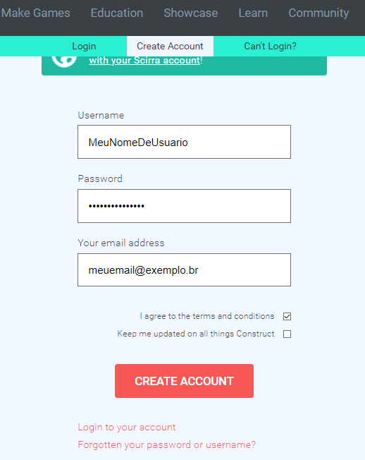

*Formulário de criação de conta*

Você receberá um e-mail de confirmação (caso não receba não esqueça de verificar a lixeira)

 *E-mail recebido*

Abra o e-mail e clique no link de confirmação

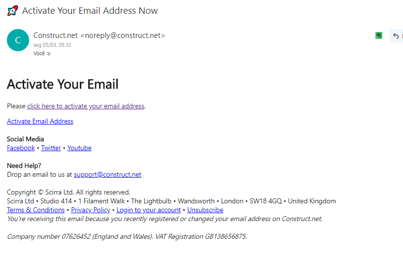

*Mensagem*

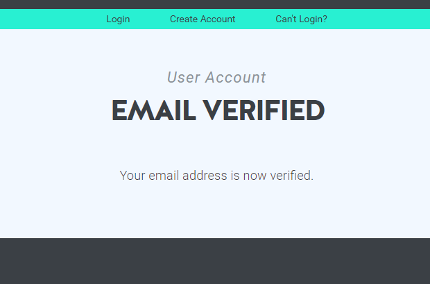
*Conta verificada*

Agora volte para o site do Construct 3 e faça login na conta que você criou

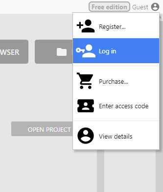
*Botão de login*

*Campos de login*

#### Criando um novo projeto

Clique no botão `NEW PROJECT` e coloque as configurações conforme as da imagem, então clique em `Create`

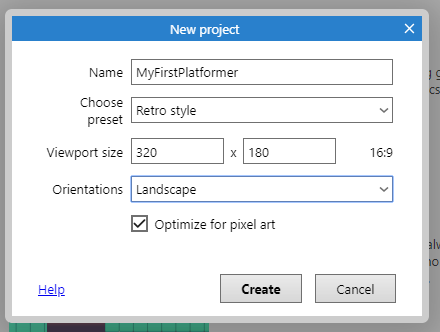

* **Name**: "MyFirstPlatformer"
  * Pode ser o nome que você quiser, mas é melhor colocar algo que te ajude a encontrar o arquivo
* **Choose preset**: "Retro style"
  * Aqui é escolhida a resolução do jogo, como o jogo terá o estilo 16-bits, escolhemos o *RetroStyle*
* **Viewport size**: "320 x 180"
  * Esse valor não precisa ser alterado
  * Aqui é escolhida a área que a câmera do jogo vai "filmar", indica o tamanho do retângulo pontilhado que você vai ver a seguir
* **Orientations**: "Landscape"
  * A orientação do jogo define se a tela será mostrada na **Horizontal ou Paisagem** (*Landscape*), na **Vertical ou Retrato** (*portrait*) ou **Ambos** (*any*)
  * Como será um jogo para computador, definimos a orientação como **Paisagem**
* **Optimize for pixel art**:  [x]
  * O jogo terá um estilo retro, por isso marcamos a opção de otimizá-lo para pixel art

Clique em `Create` e a ferramenta de edição será aberta

#### Configurando o armazenamento em Nuvem

Antes de tudo, vamos configurar o armazenamento e salvamento automático do seu jogo em **nuvem**. Será guardado como um arquivo no seu **Google Drive**, **OneDrive** ou **Dropbox**. É preciso autorizar o Construct a salvar e ler os arquivos do jogo de uma dessas contas.

Vá em `Menu > Project > Save`

Nesse exemplo, será utilizado o Google Drive, mas os passos são muito semelhantes para as outras ferramentas.

Faça login em sua conta

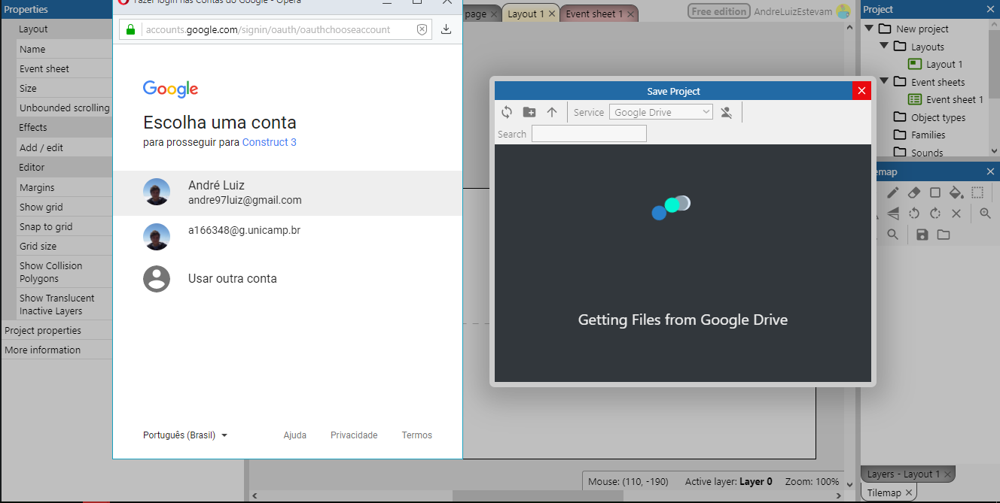

Permita o acesso do Construct3

Use a ferramenta para criar uma nova pasta e salve o projeto nela
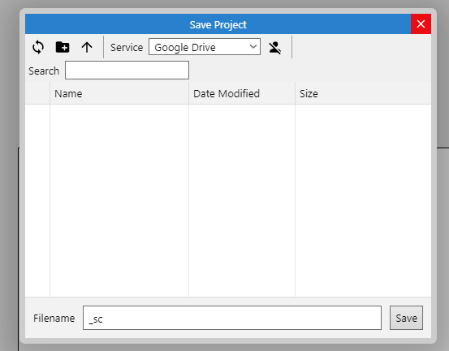
Se você preferir, pode baixar uma cópia do jogo a qualquer momento e guardá-la com você, vá no seguinte menu

Caso você queira carregar esse arquivo que baixou, use a opção `load from file` na página inicial

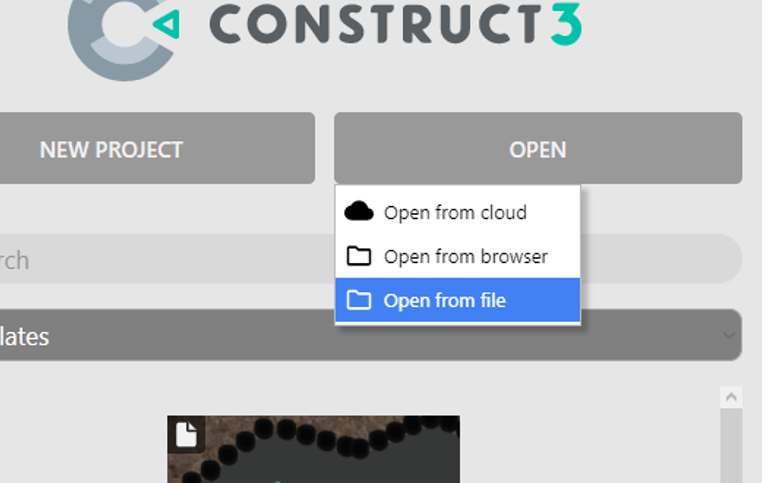

e selecione o arquivo baixado

### Abas

Pronto, agora o projeto foi criado e o backup está configurado, vamos começar a entender a interface

Na ferramenta, existem dois tipos de abas:
* Layout
* Event Sheet

* Na aba **layout** é feito tudo relacionado a parte **gráfica** e **configurações** do jogo
* Na aba **event sheet** é feito tudo relacionado a **programação** do jogo

## Aba Layout
#### Área de Layout
No layout você perceberá que existem dois retângulos, um retângulo brando e uma área pontilhada dentro dele

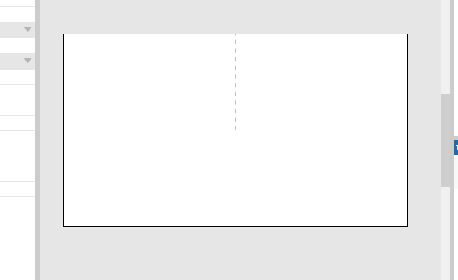

O retângulo maior define a área onde seu jogo vai acontecer, essa área é chamada de **layout** ou **cena** do jogo, é importante concentrar seu jogo nela já que para deixar o jogo **mais rápido** e **economizar memória** é comum que se delete algum elemento do jogo que esteja **fora do layout**.

O retângulo menor com lados tracejados define onde a **câmera** do jogo começará, ou seja, quando você rodar o jogo, o que estiver **dentro do retângulo** será mostrado na tela, por conta disso, é interessante começar o jogo por ele.

#### Menu de Propriedades
Conforme objetos forem adicionados, quando você clicar neles as propriedades serão exibidas nesta janela.
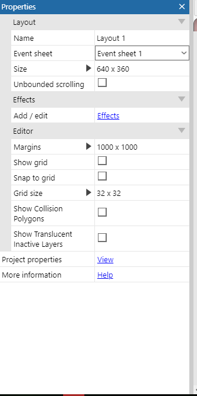

#### Menu Projeto

Nesse menu ficam todos os arquivos do jogo, inclusive os mostrados nas abas de **Layout** e **Event sheet**.

**Dica:**

Caso as abas **Layout** ou **Event Sheet** desapareçam, use este menu para abri-las novamente, você pode dar um clique duplo ou usar o botão direito do mouse.

#### Tilemap
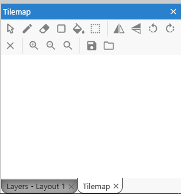
Este menu é utilizado para facilitar a criação do visual do seu jogo, você verá isso em detalhes nos próximos tópicos.

#### Layers
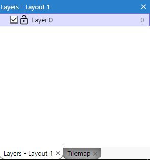
O jogo pode ser dividido em camadas, esse menu é utilizado para gerencia-las, usando esse esquema você pode colocar objetos atrás ou na frente do cenário principal e ter um controle melhor disso, podendo deixar transparente todos os objetos que estão em uma determinada camada, por exemplo.

**Dicas:** 

1. Se você tentou **mudar o cenário** e não conseguiu, verifique se o desenho do cadeado está marcado como fechado e clique mara marca-lo como aberto, cadeado fechado indica que a camada não pode ser editada
2. Se você percebeu que o cenário que estava fazendo **desapareceu**, verifique se a caixa de checagem antes do cadeado está desmarcada, caixas desmarcadas indicam que o que estiver naquela camada não deve ser mostrado na tela

Vamos começar mudando o nome dessa camada, clique no nome dela para seleciona-la, você verá que o conteúdo do menu de propriedades mudará.

Vá no campo `name` e mude o valor dele de `layer 0` para `game` e aperte `enter` para confirmar

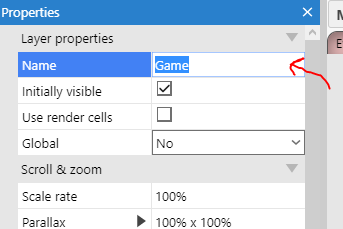

#### Dicas
**Menus sumiram**

Se você perceber que algum dos menus citados anteriormente desapareceu, o coloque de volta usando o menu `menu > View > Bars`

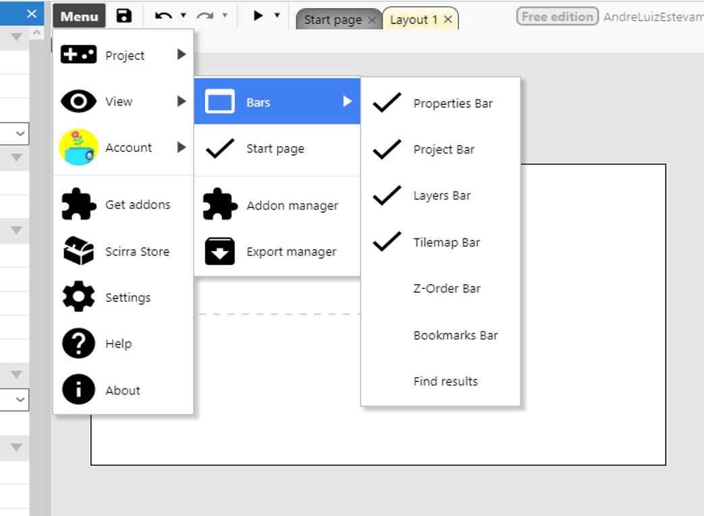
você perceberá que caso clique em um menu faltante (tirando os três últimos da lista que estão disponíveis apenas na versão paga do Construct) ele aparecerá na tela, você pode arrasta-lo para a posição que desejar.

**Nomes**

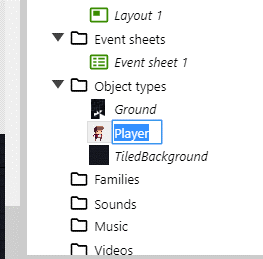

Sempre renomeie os objetos do jogo para o que eles representam, isso será muito útil e facilitará seu trabalho na hora da programação.

Use `F2` com o mouse sob o campo que quer editar ou use a ferramenta de renomear

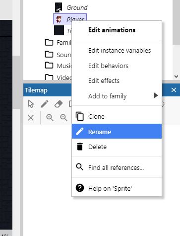

**Teclas de atalho e uso do mouse**

* Use a tecla `F11` para colocar ou tirar a ferramenta da tela cheia
* Use `shift + roda do mouse` para dar zoom no cenário
* `Aperte a roda do mouse e arraste` ou `espaço + arrastar o mouse`para se mover pelo cenário
* Use a tecla `F2` com o mouse em cima de um campo de **texto** para editá-lo
* `roda do mouse` para se mover na **vertical**
* `shift + roda do mouse` para se mover na **horizontal**
* `ctrl + e` para ir ao **event sheet**
* `ctrl + l` para ir ao **layout**

### Adicionando um Objeto ao jogo
Tudo dentro do jogo é representado como **objetos** de vários tipos, o **teclado** é tratado como um objeto assim como o **jogador** é tratado como um objeto, mas eles são de **tipos diferentes**, portanto, realizam **ações diferentes**.

Vamos inserir um objeto que representa o **teclado** 

Clique com o `botão direito do mouse` e escolha a opção `insert new object`

Você verá a lista dos tipos de objeto

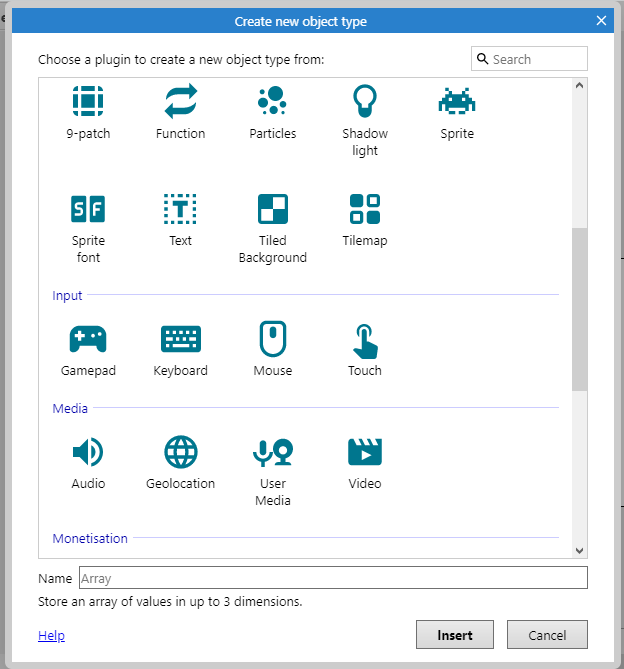

Existem muitos tipos de objetos:

* Objetos para guardar informações
* Para representar **elementos visuais** dentro do jogo
* Para interagir com o usuário desde com o teclado até com a webcam
* Para se comunicar com a internet e com as redes sociais

Para começar, procure o objeto `Keyboard` e dê um clique duplo nele para adicioná-lo ao jogo.
Você verá que ele foi adicionado à pasta de tipos de objeto.

Esse processo se repetirá para todos os objetos que adicionaremos ao jogo, alguns dos mais utilizados são:

* ***Sprite***: podem representar qualquer objeto no jogo, jogador, inimigo, cenário etc.
* ***TiledBackground***: utilizado para colocar uma **imagem de fundo** no jogo, você pode partir de uma só imagem e fazer com que ela se repita como um **mosaico**
* ***Tilemap***: utilizado para construir elementos de cenário, é comum que se coloquem os "blocos" que representam o cenário em uma só imagem, um *tilemap* permite separar cada bloco
* ***Text***: utilizado para escrever textos no jogo
* ***Spritefont***: funciona como o *text* mas a fonte é estilizada e tem como fonte um arquivo de imagem
* ***Particles***: se baseia em uma imagem para criar partículas no jogo como fumaça, poeira ou fogo, por exemplo
* ***Gamepad***, ***Keyboard***, ***Mouse*** e ***Touch***: são utilizados para interagir com os equipamentos que dão o nome a eles

# Vamos começar
## *Background*

Adicione um novo objeto do tipo `Tiled Backgound`

Use a opção de pasta para selecionar o arquivo do computador

Vá até a pasta onde estão os planos de fundo e escolha o arquivo `Background/tiled_bg.png`

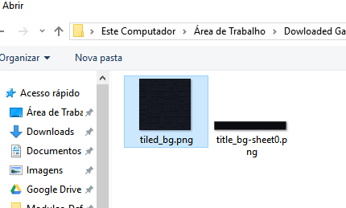

Com o arquivo importado, aumente o tamanho do *tiled Background* para que ele preencha todo o *layout* e um pouco mais.
As imagens de fundo são especialmente preparadas para que pareçam uma só quando colocamos várias delas lado a lado, funciona como um **mosaico**

## Plataforma

Adicione um novo objeto da mesma forma como você fez antes, mas dessa vez escolha o tipo `Tilemap`

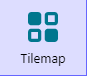

Abra o gerenciador de arquivos e selecione a imagem `Scenario/tilemap.png` 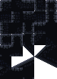
Essa imagem possui vários blocos de 16 por 16 pixels que representam o **chão** do game

Assim como o *Tiled Background* aumente o tamanho do objeto para que ele fique maior que a tela

**Dica:** ao mudar o tamanho de objetos, você pode apertar `Shift` e arrastar o mouse clicando em uma das abas para mudar o **tamanho** do objeto sem fazer com que ele seja distorcido

Mude a aba inferior de *Layers* para *Tilemap*, passando o mouse por cima dos desenhos você verá que a seleção é maior que o tamanho dos blocos, precisamos mudar isso indo nas propriedades e mudando os atributos

*  `Tile width` e `Tile heigh` para `16`

Agora você pode clicar em uma **célula** no menu *tilemap* e usar a ferramenta lápis para desenhar o cenário do seu jogo

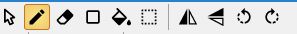

* 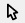 Use para voltar ao mouse normal
* Use para pintar o cenário
*  Use para apagar algum erro
* Use para pintar áreas maiores
* 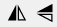 Use para espelhar a célula selecionada
* 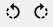Use para rodar a célula selecionada

## Adicionando o personagem

Abra a janela de criação de objetos e escolha um do tipo `Sprite`

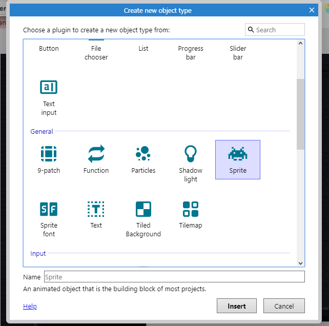

Abra o gerenciador de arquivos e escolha a imagem `Player\Decomposed\Idle\tile000.png` (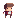). Na pasta você verá que existem outros arquivos para fazer a animação de quando o personagem está parado, faremos a animação mais adiante.

Clique na tela para adicioná-lo
Se você apertar o botão de executar verá que o jogador está flutuando

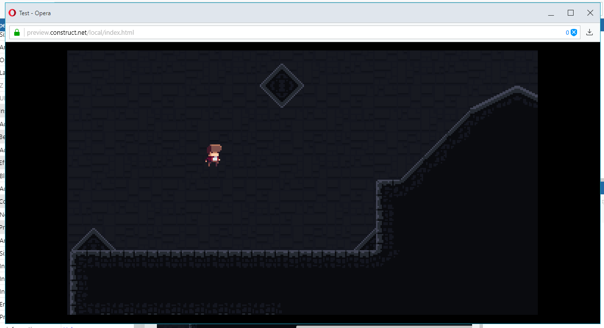

Isso acontece pois esse é um objeto do tipo ***Sprite***, que não tem um comportamento definido, precisamos dar a ele o comportamento de **plataforma**

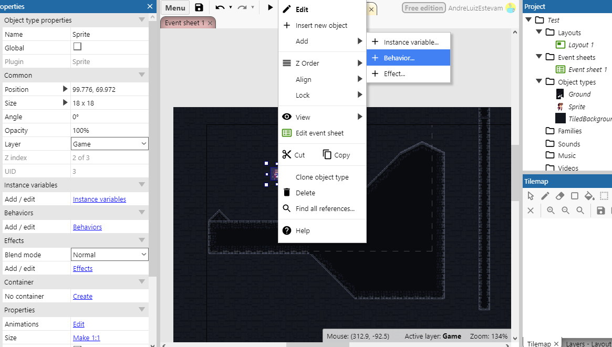 

Se você apertar o botão para executar agora verá que o player irá atravessar o chão e cair para o infinito, isso acontece já que precisamos dar ao **chão** algum **comportamento** que permita a interação com o jogador

Use o menu lateral para selecionar o *Tilemap* e entre no menu *Add behavior*, antes disso, aproveite para renomear os objetos para o que eles irão representar no jogo

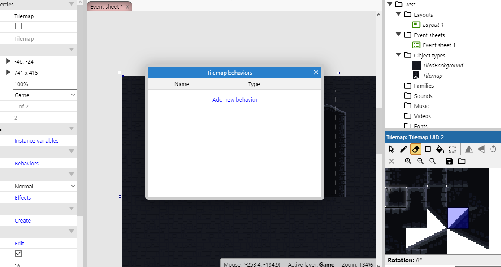

Aplique o comportamento `Solid`

Agora o jogador e o cenário podem interagir um com o outro, mas você perceberá que existem vários problemas

* Em alguns lugares o jogador atravessa o chão ou fica flutuando em cima dele
* O jogador está muito rápido e pula muito alto (até sai da tela)
* Não existe animação de andar, pular ou olha para o lado certo

Vamos resolver esses problemas

### Box collision

Para determinar se um objeto está encostando em outro usamos um conceito chamado ***Box collision*** ou ***Collision Polygon***, como seria muito complexo para o computador usar as imagens que colocamos para determinar se dois objetos estão se tocando, ele desenha um polígono em cima desses desenhos para simplificar esse teste
No caso do chão, o construct colocou um **quadrado** como polígono, sendo que algumas formas são **triangulares**
Procure os ***tiles*** que não completam o quadrado completamente e dê um clique duplo em um deles

Clique no ícone da ferramenta de editar o polígono de colisão

Você pode **arrastar os quadrados vermelhos** para mudar a forma do polígono. Dê um duplo clique em um deles para gerar mais um e clique uma vez e aperte `Delete` ou `Backspace` para removê-lo

Faça esse processo para todos os *tiles* que não forem quadrados completos.
Precisamos repetir o mesmo processo para o *sprite* do jogador

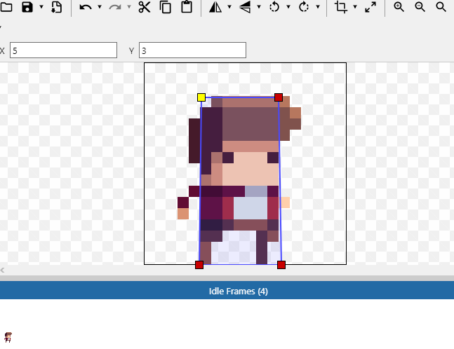

Agora se você executar o jogo vai ver que a interação entre o personagem e o mapa está muito melhor
### Mudando as propriedades do *Player*

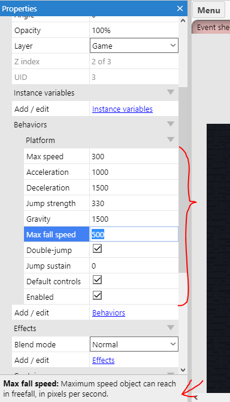

Aqui estão alguns valores recomendados, você pode escolher os que quiser para seu jogo, mas é importante escolher com sabedoria já que você pode precisar reconstruir o cenário todo caso mude a forma como o jogador se move.

Note também que existe uma barra na parte inferior que diz o que o campo selecionado faz.

### Adicionando animações

Dê um clique duplo no personagem. Note que há uma barra lateral indicando quais animações o personagem tem e uma outra na parte inferior mostrando os frames da animação corrente.

Vamos começar com a animação de quando o jogador está parado, mude o nome da única animação existente para `idle`

Na área dos frames escolha a opção `Import Frames > From Files` para dizer que iremos importar os frames da animação cada um de um arquivo

Selecione os arquivos em `Tiles\Player\Decomposed\Idle` e delete o quadro de número zero já que ele é o que estava anteriormente

Você pode usar a opção `Preview` para ver como a animação está

Como você pode ver, a animação acontece apenas uma vez e está muito lenta, vamos alterar isso.

Com a animação `Idle` selecionada, vamos definir a velocidade como `8` frames por segundo e vamos marcar a opção de loop

O mesmo processo deve ser aplicado para as animações

* Idle
  * Speed: 8
  * Loop: sim
* Shoot
  * Speed: 15
  * Loop: não
* Jump
  * Speed: 5
  * Loop: não
* Fall
  * Speed: 5
  * Loop: não
* Run
  * Speed: 14
  * Loop: sim

### Editando a *Collision Box*

Como adicionamos mais animações precisamos definir as caixas de colisão para elas, dessa vez faremos um trabalho mais preciso.

Segurando a tecla `ctrl` clique nos dois quadrados vermelhos acima do personagem, você vai selecionar ambos e eles ficarão amarelos, use a seta para baixo para mover a linha até a cabeça do personagem

Repita o processo para os outros lados desta forma:

Agora clique no personagem com o botão esquerdo do mouse e escolha a opção `Apply to all animations`

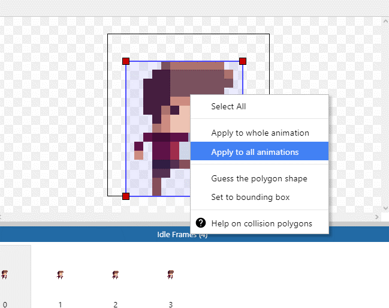

Agora todas as animações usarão esse mesmo polígono

### Mudando a origem

Para garantir gue todos os frames fiquem alinhados e para fazer o efeito de poeira saindo dos pés do personagem (que faremos logo a seguir) precisamos mudar a origem da imagem. O ponto de origem é o ponto utilizado para alinhar os frames de uma animação, vamos colocá-lo nos pés do personagem.

Use a opção para colocar o ponto de origem na parte de baixo da imagem

Agora aplique essa mudança para todas as animações

### Adicionando partículas

Vamos colocar um efeito de poeira quando o jogador cair no chão, para começar, adicione um novo objeto do tipo *Particles*

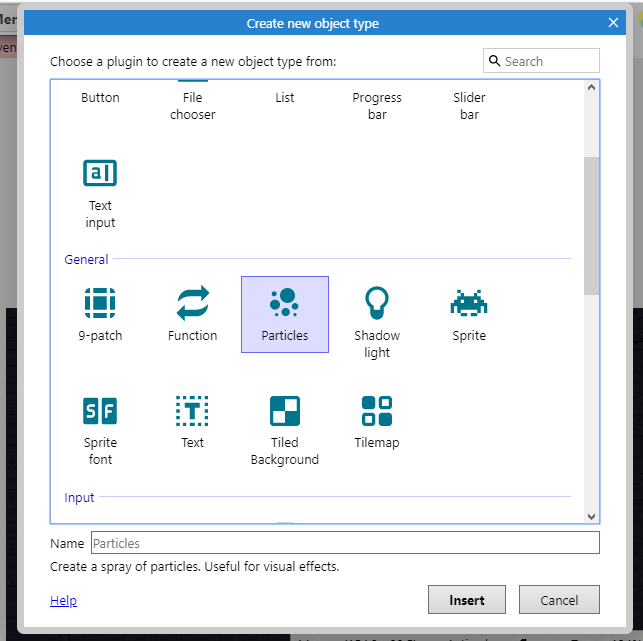

Clique na tela para adicionar o objeto, na janela que irá abrir selecione o arquivo `Particles/playerdust.png`

É importante que esse objeto esteja no jogo mas **não esteja visível** , ou seja, ele deve estar **fora do layout**, quando precisarmos dele faremos que apareça nos pés do jogador.

Renomeie o objeto para podermos programar com ele mais facilmente mais tarde

Use a opção `Z Order > Send to top of layer` para traze o objeto para o topo da camada fazendo com que efeito apareça **na frente** do personagem
Defina as propriedades conforme a seguinte imagem

## Aba Event Sheet

Nesta aba é onde ficará o código que definirá os **comportamentos do jogo** por meio de **eventos**

Um evento é uma **condição** ligada a um ou mais **objetos** do jogo, por exemplo: no game, o teclado será representado por um **objeto** do tipo **Keyboard**, pois são os **objetos** que podem lançar **eventos**, assim, podemos no código monitorar por algum **evento específico**, nesse caso, pode ser quando alguma tecla for pressionada ou solta, então podemos executar alguma ação quando esse evento ocorrer.

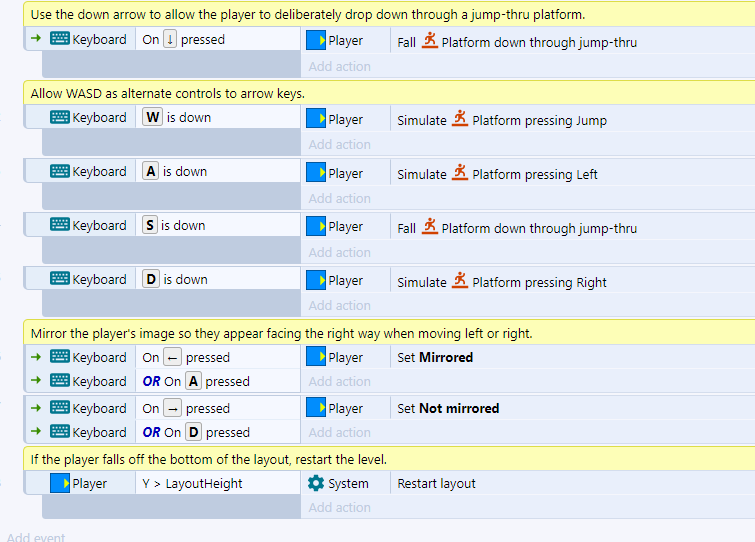

Alguns eventos comuns são:

* Quando algum objeto do jogo está tocando outro
  * Inimigo tocou no jogador: tirar pontos de vida do jogador
  * Jogador tocou em uma moeda: faça a moeda sumir e adicione na pontuação do jogador
* Quando o jogador está andando, pulando ou parado
  * Mude para a animação correspondente

**Lembre-se:**

1. Um evento é qualquer acontecimento dentro do jogo
2. Posso criar um código que é ativado quando um evento ocorrer
3. Posso decidir quais ações devem acontecer quando esse evento for acionado

Você pode criar um evento clicando em `Add event`

Será te perguntado a **condição**, ela tem que estar relacionada a um dos **objetos** do jogo

Uma lista de **eventos** daquele **objeto** aparecerá, você pode escolher qual deles você quer monitorar

Existem dois tipos de eventos

* Eventos que **não começam** com `On`
  * As **ações** serão executadas **enquanto** a **condição** for verdadeira
  * Se a ação for fazer o personagem pular, ele irá pular **repetidamente** até você soltar a tecla
* Eventos que **começam** com `On`
  * As **ações** são executadas na **primeira vez** que a ação for verdadeira, ou seja, apenas **no instante** que o evento ocorrer
  * Se a ação for fazer o personagem pular, ele irá pular **uma vez** e só pulará novamente se você soltar a tecla e apertá-la novamente

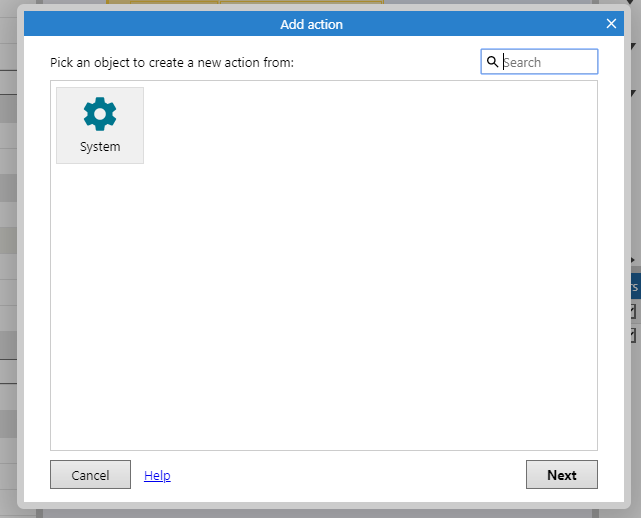

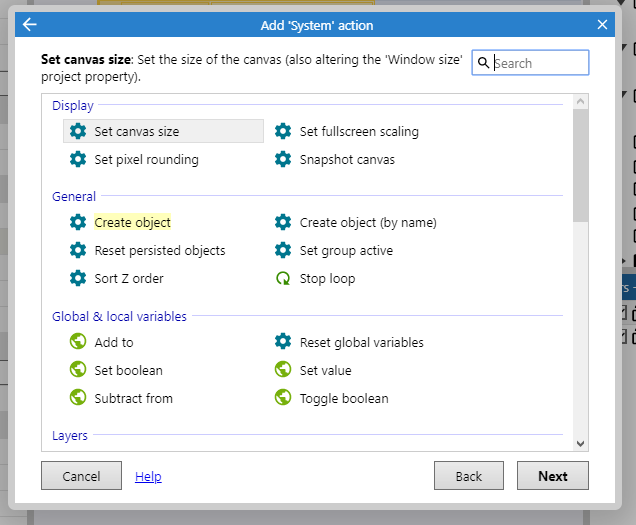

### Tipos de eventos

#### Evento do tipo *AND* / E

Você pode precisar que mais de um evento esteja acontecendo ao mesmo tempo para executar algum bloco. Quando exite **mais de uma condição** e precisamos que **todas** sejam verdadeiras, usamos o *AND*

Inserindo uma nova condição

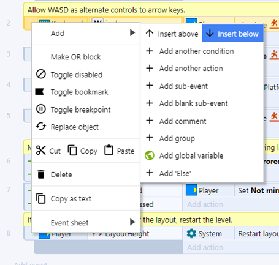

Outra forma de fazer isso

Um bloco do tipo *AND* fica dessa forma

#### Evento do tipo *OR* / *OU*

Num evento do tipo *OR* , o bloco é executado quando **uma ou mais** condições são verdadeiras.

Para fazer um bloco *OR* você precisa começar por um do tipo *AND* e usar a opção `Make OR block`

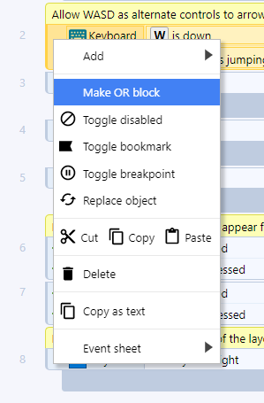

Ele ficará assim:

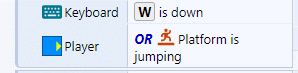

Você pode torná-lo um bloco *AND* usando a seguinte opção:

#### Invert

Caso você queira que o bloco **seja executado** quando uma condição **não** for verdadeira, use a opção *invert*

Um bloco com um invert fica assim:

Perceba que na imagem existe uma junção do bloco *AND* com o  *invert* nesse caso, você pode ler essa condição como:

*"Execute as ações a seguir **se** A tecla *W* do teclado estiver sendo apertada **E** o player **Não** estiver pulando"*

#### *Else* (Senão)

Um bloco do tipo *else* é executado quando o que foi testado em um evento não ocorreu: você pode fazer o teste de algo e o seu inverso em um mesmo bloco.

Um bloco else é criado dessa forma:

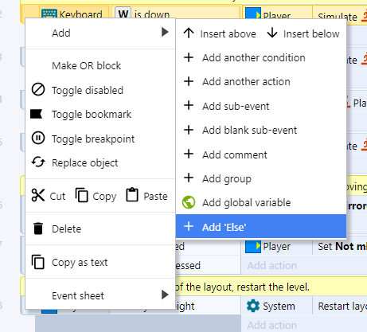

O resultado será:

Você pode ler o *else* como: *Execute essa ação se algo acontecer, **caso contrário** execute outra ação*

# Começando a programação

Primeiramente, vamos criar um grupo para conter os movimentos do jogador, isso será importante pois precisaremos desativar todos os movimentos na hora do jogador atirar a flecha

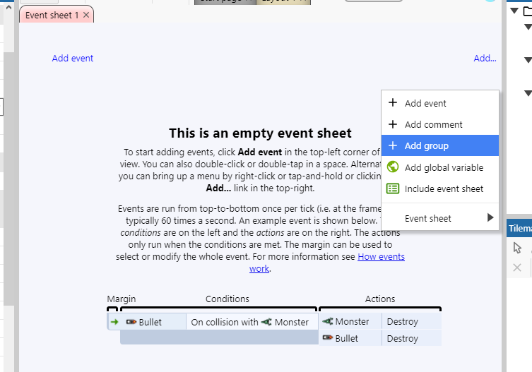

Como vamos adicionar os eventos ao grupo *Player Movement*, precisamos usar a opção `Add event to 'Player Movement'`

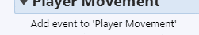

Selecione o *Player*, a condição vai ser baseada nele

Vamos começar criando o bloco onde a animação do jogador correndo será ativada quando ele estiver se movendo e estiver no chão, assim a animação de correndo não acontecerá quando o jogador estiver pulando

Se você executar o jogo agora vai ver que o jogador passa para a animação de correr quando as teclas direcionais são apertadas, mas não volta para a animação de parado. Isso não foi programado ainda...

**Dica:** agora é uma boa hora para rever a velocidade máxima que o player pode chegar e a velocidade da animação dele correndo para que os dois fiquem em sincronia.

### Fazendo o player parar

### Fazendo o player olhar para a direção correta

Se você não tem o Objeto *Keyboard* adicionado ao projeto, adicione-o

Crie um novo evento partindo do objeto teclado e escolha o evento `On key pressed` e aperte a seta para a esquerda para definir que queremos que  código seja executado quando a tecla para a esquerda for pressionada

### Pulando, caindo e poeira

### Como o Construct executa a *event sheet*?

É preciso lembrar que, no Construct, todas as ações programadas precisam ser precedidas por um evento, pode-se dizer que, quando algo acontece no jogo um evento é disparado no código e ações são tomadas.

Mas como o jogo **sabe** que alguma ação aconteceu no jogo?

É simples, você pode enxergar a *event sheet* como uma lista de condições, o construct percorre todas elas em *loop*, testando se alguma condição é **verdadeira** se for, as ações associadas a essa condição são executadas.

O tempo para percorrer todo o código é chamado de ***tick***, é um conceito parecido com o **FPS** (*frames per second*) de um jogo ou vídeo, onde um **frame**  representa uma das **foto** instantânea em cada momento do jogo, então, mais FPS representam mais fotos por segundo, da mesma forma, em um computador mais rápido, o código é executado em menos tempo e o tempo entre um **tick** e outro é **menor** então em poucos segundos cabem **mais** ticks.

# Câmera

Nossa câmera será representada por um objeto do tipo *Sprite*, precisamos:

* Criar um novo sprite
* Pintá-lo de uma cor para que possamos vê-lo durante a programação
* Mudar seu nome para `Camera`
* Marcar em suas propriedades que quando o jogo iniciar deve ser invisível
* Fazer a programação associada

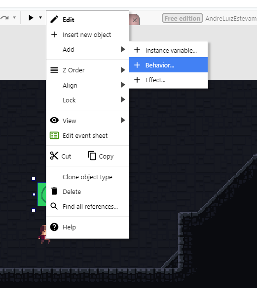

Vamos adicionar um evento do tipo `System > Every tick` **fora** do grupo `Player Movement`

Para suavizar o movimento da câmera vamos usar a função `lerp`, ela causará um atraso no movimento da câmera num fator de `0.03`  ao ir da posição `x,y` de onde está (`Self`) até a posição `x,y` do jogador (`Player`)

Uma função na programação funciona de maneira muito parecida com uma função na matemática, uma função é algo que:

Tem um nome e recebe um valor de entrada como:
$$
f(15)
$$

Faz algum cálculo baseado em uma fórmula:
$$
f(x) = 3x + 2
$$
E retorna algum valor como saída
$$
y = f(15) = 3 * 15 + 2
$$

$$
y = 45 + 2
$$

$$
y=47
$$

Uma forma mais simples de fazer a câmera (mas não tão boa):

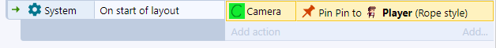

# Plataformas e Plataformas móveis

Vamos adicionar três sprites ao jogo, eles deverão receber como imagem

* `Scenario/mov1-sheet0.png` 
* `Scenario/mov5-sheet0.png`
* `Scenario/bridge-sheet0.png` 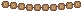

Vamos renomeá-los da seguinte forma:

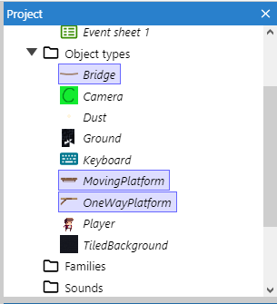

Vamos aplicar aos três o *Behavior* de `Jump Tru` que fará com que o personagem possa ficar em cima deles mas que ao pular por baixo os atravesse.

É importante também ter as caixas de colisão feitas para que o personagem possa andar na plataforma

Agora vamos fazer com que o objeto `MovingPlatform` se torne uma plataforma que se move. Adicione o comportamento `Sine`

Configure-o da seguinte forma

Você pode alterar esses valores para ter o efeito desejado, 

* mude a direção em `Movement: Horizontal`ou `Vertical`
* Use o atributo `Period` para alterar o **período** do movimento, isto é, o tempo de cada ciclo
* Use o atributo `Magnitude` para alterar o **tamanho** do movimento

Dependendo do efeito que quiser passar você pode mudar o tipo da onda em `Wave`

* `Sine`: acelera no meio do movimento e desacelera quando vai mudar de direção
* `Triangle`: permanece com a mesma velocidade, sem desacelerar para mudar a direção
* `Square`: irá aparecer e desaparecer nas pontas de onde o movimento ocorre
* `Sawtooth` e `Reverse Sawthooth`: vai para a direita (ou esquerda), some e volta a origem

**Dica:** na hora de posicionar a plataforma que se movimenta no layout, coloque-a no **meio** da área que deve cobrir com o movimento

**Dica:** depois de ter todas as plataformas prontas você pode criar uma cópia facilmente clicando e arrastando uma plataforma pronta enquanto segura a tecla `crtl`

# Colecionáveis

## Parte visual

Crie um objeto do tipo *Sprite* para representar as moedas, crie duas animações com base nas imagens em `Items\Coin_spin` e `Items\Coin_shine`

 

Você pode usar a mesma técnica para duplicar objetos ensinada antes e definir qual vai ser a animação que deve ocorrer na moeda da seguinte forma:

## Parte Lógica

O primeiro passo é criar uma variável de instância ao Player. Uma variável de instância é um campo que nos permite guardar um valor como um número ou um texto junto com algum objeto, nesse caso o objeto *Player*

Nosso objetivo é criar esse bloco:

Para a primeira linha escolha `Coin > Destroy`

Para a segunda use o `Player > Add to` conforme as imagens

Agora vamos criar uma variável global para guardar a quantidade total de moedas

## Interface com o usuário

### *Sprite Font*

Uma *Sprite Font* funciona como uma fonte no computador como *Times New Roman* ou *Arial*, mas as letras podem ser estilizadas e são armazenadas todas em um mesmo arquivo.

Crie um novo objeto do tipo *Sprite Font*

Defina como imagem o arquivo `Fonts/font30b.png` 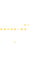

Não esqueça de renomear o objeto

Vá nas propriedades desse objeto e deixe-as assim:

Se a configuração foi feita corretamente você conseguirá ler `0/0 COINS` no objeto, arraste-o para o topo esquerdo da tela

Se você executar o jogo agora perceberá que o texto aparece mas que quando o personagem anda o texto sai da tela, para resolver isso precisamos aplicar o *Behavior* `Anchor`

`Player.Coins & " /"`

# Links

https://ezgif.com/sprite-cutter

