# Construct 3

---


[TOC]


## O que é?

* **Construct 3** é uma ferramenta para a criação de jogos **2D** voltada para **não programadores**;
* A versão 3 do Construct é baseada na plataforma web, ou seja, nada precisa ser baixado ou instalado no computador, o acesso pode ser feito por um *browser* atualizado como Google Chome, Mozila Firefox, Opera, Safari etc.;
* Foi desenvolvido pela **Scirra Ltda** e a primeira versão foi lançada em 2007;
* Permite a criação rápida de jogos por meio do sistema ***drag-and-drop*** (arrastar e soltar);
* No Construct entender a **lógica** de como um jogo funciona é **mais importante** do que saber alguma linguagem de programação já que o código do jogo é feito de forma **visual** por meio de **blocos**;

## Primeiros passos no Construct3
### Vendo exemplos
#### Jogos prontos
* A ferramenta pode ser acessada pela URL: [editor.construct.net](https://editor.construct.net);
* Se você preferir pode usar a versão desktop da ferramenta (download em: [C3 Desktop](https://downloads.scirra.com/c3-desktop/win64/construct3-win64-c64-stable.zip));
* Já na página inicial você pode encontrar alguns exemplos de jogos prontos e de modelos, os modelos são muito úteis para entender como alguns comportamentos simples funcionam;


*Exemplos de jogos prontos*

#### Modelos (*Templates*)


*Modelos para jogos*

Você pode clicar no ícone do projeto ou em *"Open project"* para abrir um desses projetos. Se ele for um modelo, você pode criar seu jogo tranquilamente se salvar como um jogo separado.

### Vamos começar...
#### Criando uma nova conta
Como usaremos a versão gratuita do Construct, é necessário que criem uma conta no site pois com uma conta e com o e-mail verificado algumas opções são desbloqueadas:


*Funções disponíveis na versão gratuita **sem login***:


*Funções disponíveis na versão gratuita **com login***

Para criar uma nova conta vá em `guest` e então em `register`:


*Menu para a criação da conta*

Preencha o formulário com um **nome de usuário**, **e-mail** (algum que você tenha acesso fácil já que um e-mail será mandado para ele) e uma **senha**:


*Formulário de criação de conta*

Você receberá um e-mail de confirmação (caso não receba não esqueça de verificar a lixeira)


 *E-mail recebido*

Abra o e-mail e clique no link de confirmação


*Mensagem*


*Conta verificada*

Agora volte para o site do Construct 3 e faça login na conta que você criou


*Botão de login*


*Campos de login*

#### Criando um novo projeto

Clique no botão `NEW PROJECT` e coloque as configurações conforme as da imagem, então clique em `Create`


* **Name**: "MyFirstPlatformer"
  * Pode ser o nome que você quiser, mas é melhor colocar algo que te ajude a encontrar o arquivo
* **Choose preset**: "Retro style"
  * Aqui é escolhida a resolução do jogo, como o jogo terá o estilo 16-bits, escolhemos o *RetroStyle*
* **Viewport size**: "320 x 180"
  * Esse valor não precisa ser alterado
  * Aqui é escolhida a área que a câmera do jogo vai "filmar", indica o tamanho do retângulo pontilhado que você vai ver a seguir
* **Orientations**: "Landscape"
  * A orientação do jogo define se a tela será mostrada na **Horizontal ou Paisagem** (*Landscape*), na **Vertical ou Retrato** (*portrait*) ou **Ambos** (*any*)
  * Como será um jogo para computador, definimos a orientação como **Paisagem**
* **Optimize for pixel art**:  [x]
  * O jogo terá um estilo retro, por isso marcamos a opção de otimizá-lo para pixel art


Clique em `Create` e a ferramenta de edição será aberta


#### Configurando o armazenamento em Nuvem

Antes de tudo, vamos configurar o armazenamento e salvamento automático do seu jogo em **nuvem**. Será guardado como um arquivo no seu **Google Drive**, **OneDrive** ou **Dropbox**. É preciso autorizar o Construct a salvar e ler os arquivos do jogo de uma dessas contas.

Vá em `Menu > Project > Save`
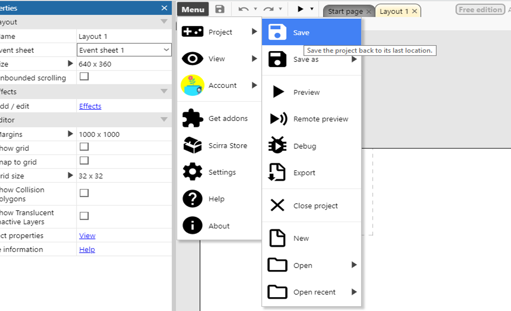

Nesse exemplo, será utilizado o Google Drive, mas os passos são muito semelhantes para as outras ferramentas.

Faça login em sua conta:


Permita o acesso do Construct3:


Use a ferramenta para criar uma nova pasta e salve o projeto nela:
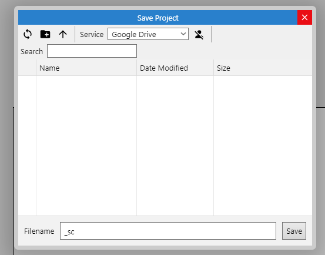

Se você preferir, pode baixar uma cópia do jogo a qualquer momento e guardá-la com você, vá no seguinte menu:


Caso você queira carregar esse arquivo que baixou, use a opção `load from file` na página inicial:


e selecione o arquivo baixado


### Abas

Pronto, agora o projeto foi criado e o backup está configurado, vamos começar a entender a interface

Na ferramenta, existem dois tipos de abas:
* Layout
* Event Sheet


* Na aba **layout** é feito tudo relacionado a parte **gráfica** e **configurações** do jogo
* Na aba **event sheet** é feito tudo relacionado a **programação** do jogo


## Aba Layout

#### Área de Layout
No layout você perceberá que existem dois retângulos, um retângulo brando e uma área pontilhada dentro dele


O retângulo maior define a área onde seu jogo vai acontecer, essa área é chamada de **layout** ou **cena** do jogo, é importante concentrar seu jogo nela já que para deixar o jogo **mais rápido** e **economizar memória** é comum que se delete algum elemento do jogo que esteja **fora do layout**.

O retângulo menor com lados tracejados define onde a **câmera** do jogo começará, ou seja, quando você rodar o jogo, o que estiver **dentro do retângulo** será mostrado na tela, por conta disso, é interessante começar o jogo por ele.


#### Menu de Propriedades
Conforme objetos forem adicionados, quando você clicar neles as propriedades serão exibidas nesta janela.


#### Menu Projeto

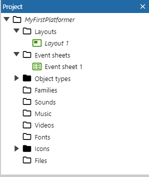

Nesse menu ficam todos os arquivos do jogo, inclusive os mostrados nas abas de **Layout** e **Event sheet**.


**Dica:**

Caso as abas **Layout** ou **Event Sheet** desapareçam, use este menu para abri-las novamente, você pode dar um clique duplo ou usar o botão direito do mouse.
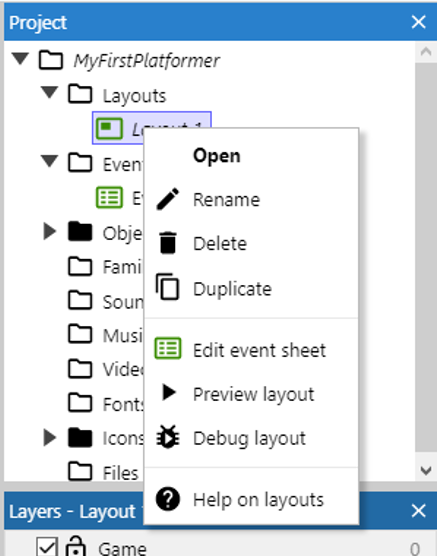


#### Tilemap
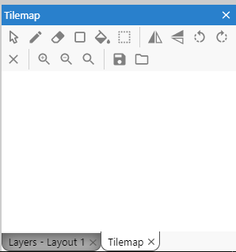
Este menu é utilizado para facilitar a criação do visual do seu jogo, você verá isso em detalhes nos próximos tópicos.

#### Layers
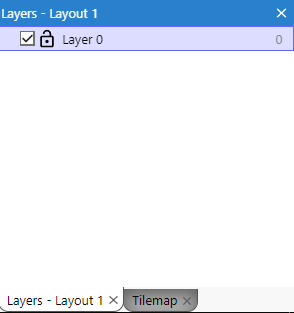
O jogo pode ser dividido em camadas, esse menu é utilizado para gerencia-las, usando esse esquema você pode colocar objetos atrás ou na frente do cenário principal e ter um controle melhor disso, podendo deixar transparente todos os objetos que estão em uma determinada camada, por exemplo.


**Dicas:** 

1. Se você tentou **mudar o cenário** e não conseguiu, verifique se o desenho do cadeado está marcado como fechado e clique para marca-lo como aberto, cadeado fechado indica que a camada não pode ser editada;
2. Se você percebeu que o cenário que estava fazendo **desapareceu**, verifique se a caixa de checagem antes do cadeado está desmarcada, caixas desmarcadas indicam que o que estiver naquela camada não deve ser mostrado na tela;

Vamos começar mudando o nome dessa camada, clique no nome dela para seleciona-la, você verá que o conteúdo do menu de propriedades mudará.

Vá no campo `name` e mude o valor dele de `layer 0` para `game` e aperte `enter` para confirmar:

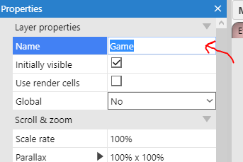

#### Dicas
**Menus sumiram**

Se você perceber que algum dos menus citados anteriormente desapareceu, o coloque de volta usando o menu `menu > View > Bars`:


você perceberá que caso clique em um menu faltante (tirando os três últimos da lista que estão disponíveis apenas na versão paga do Construct) ele aparecerá na tela, você pode arrasta-lo para a posição que desejar.


**Nomes**

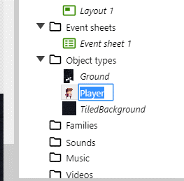


Sempre renomeie os objetos do jogo para o que eles representam, isso será muito útil e facilitará seu trabalho na hora da programação.

Use `F2` com o mouse sob o campo que quer editar ou use a ferramenta de renomear.


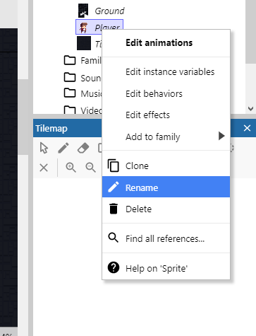


**Teclas de atalho e uso do mouse**

* Use a tecla `F11` para colocar ou tirar a ferramenta da tela cheia;
* Use `shift + roda do mouse` para dar zoom no cenário;
* `Aperte a roda do mouse e arraste` ou `espaço + arrastar o mouse`para se mover pelo cenário;
* Use a tecla `F2` com o mouse em cima de um campo de **texto** para editá-lo;
* `roda do mouse` para se mover na **vertical;**
* `shift + roda do mouse` para se mover na **horizontal;**
* `ctrl + e` para ir ao **event sheet;**
* `ctrl + l` para ir ao **layout;**


### Adicionando um Objeto ao jogo
Tudo dentro do jogo é representado como **objetos** de vários tipos, o **teclado** é tratado como um objeto assim como o **jogador** é tratado como um objeto, mas eles são de **tipos diferentes**, portanto, realizam **ações diferentes**.


Vamos inserir um objeto que representa o **teclado**. Clique com o `botão direito do mouse` e escolha a opção `insert new object`:


Você verá a lista dos tipos de objeto:


Existem muitos tipos de objetos:

* Objetos para guardar informações;
* Para representar **elementos visuais** dentro do jogo;
* Para interagir com o usuário desde com o teclado até com a webcam;
* Para se comunicar com a internet e com as redes sociais;


Para começar, procure o objeto `Keyboard` e dê um clique duplo nele para adicioná-lo ao jogo.
Você verá que ele foi adicionado à pasta de tipos de objeto.


Esse processo se repetirá para todos os objetos que adicionaremos ao jogo, alguns dos mais utilizados são:

* ***Sprite***: podem representar qualquer objeto no jogo, jogador, inimigo, cenário etc.;
* ***TiledBackground***: utilizado para colocar uma **imagem de fundo** no jogo, você pode partir de uma só imagem e fazer com que ela se repita como um **mosaico;**
* ***Tilemap***: utilizado para construir elementos de cenário, é comum que se coloquem os "blocos" que representam o cenário em uma só imagem, um *tilemap* permite separar cada bloco;
* ***Text***: utilizado para escrever textos no jogo;
* ***Spritefont***: funciona como o *text* mas a fonte é estilizada e tem como fonte um arquivo de imagem;
* ***Particles***: se baseia em uma imagem para criar partículas no jogo como fumaça, poeira ou fogo, por exemplo;
* ***Gamepad***, ***Keyboard***, ***Mouse*** e ***Touch***: são utilizados para interagir com os equipamentos que dão o nome a eles;


# Vamos começar
## *Background*

Adicione um novo objeto do tipo `Tiled Backgound`


Use a opção de pasta para selecionar o arquivo do computador.


Vá até a pasta onde estão os planos de fundo e escolha o arquivo `Background/tiled_bg.png`:

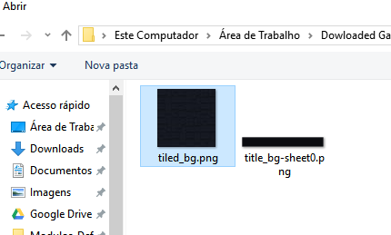


Com o arquivo importado, aumente o tamanho do *tiled Background* para que ele preencha todo o *layout* e um pouco mais.

As imagens de fundo são especialmente preparadas para que pareçam uma só quando colocamos várias delas lado a lado, funciona como um **mosaico**.


## Plataforma

Adicione um novo objeto da mesma forma como você fez antes, mas dessa vez escolha o tipo `Tilemap`


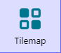

Abra o gerenciador de arquivos e selecione a imagem `Scenario/tilemap.png` 
Essa imagem possui vários blocos de 16 por 16 pixels que representam o **chão** do game

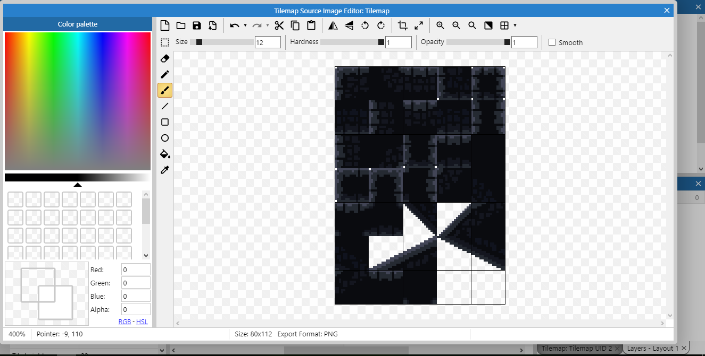


Assim como o *Tiled Background* aumente o tamanho do objeto para que ele fique maior que a tela.

**Dica:** ao mudar o tamanho de objetos, você pode apertar `Shift` e arrastar o mouse clicando em uma das abas para mudar o **tamanho** do objeto sem fazer com que ele seja distorcido.

Mude a aba inferior de *Layers* para *Tilemap*, passando o mouse por cima dos desenhos você verá que a seleção é maior que o tamanho dos blocos, precisamos mudar isso indo nas propriedades e mudando os atributos.

*  `Tile width` e `Tile heigh` para `16`


Agora você pode clicar em uma **célula** no menu *tilemap* e usar a ferramenta lápis para desenhar o cenário do seu jogo


*  Use para voltar ao mouse normal;
* Use para pintar o cenário;
*  Use para apagar algum erro;
* Use para pintar áreas maiores;
* 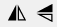 Use para espelhar a célula selecionada;
* Use para rodar a célula selecionada;


## Adicionando o personagem

Abra a janela de criação de objetos e escolha um do tipo `Sprite`


Abra o gerenciador de arquivos e escolha a imagem `Player\Decomposed\Idle\tile000.png` (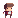). Na pasta você verá que existem outros arquivos para fazer a animação de quando o personagem está parado, faremos a animação mais adiante.

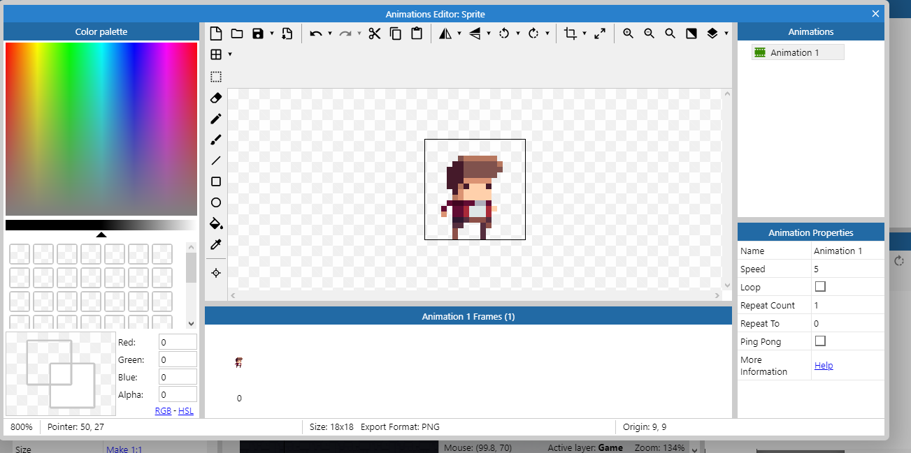

Clique na tela para adicioná-lo
Se você apertar o botão de executar verá que o jogador está flutuando

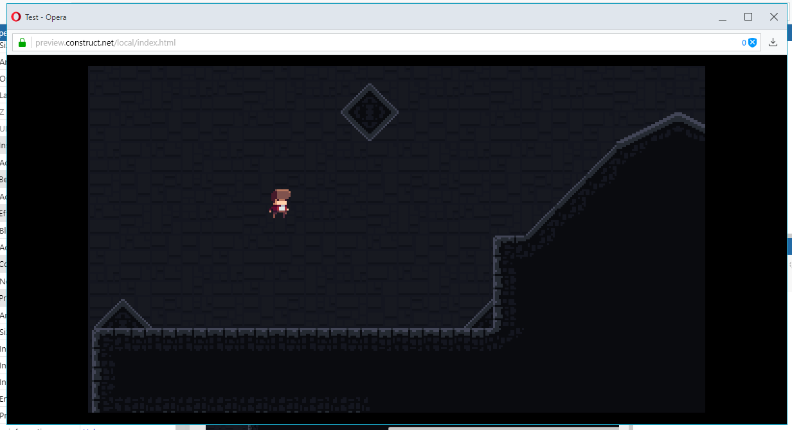

Isso acontece pois esse é um objeto do tipo ***Sprite***, que não tem um comportamento definido, precisamos dar a ele o comportamento de **plataforma**

 


Se você apertar o botão para executar agora verá que o player irá atravessar o chão e cair para o infinito, isso acontece já que precisamos dar ao **chão** algum **comportamento** que permita a interação com o jogador


Use o menu lateral para selecionar o *Tilemap* e entre no menu *Add behavior*, antes disso, aproveite para renomear os objetos para o que eles irão representar no jogo


Aplique o comportamento `Solid`


Agora o jogador e o cenário podem interagir um com o outro, mas você perceberá que existem vários problemas

* Em alguns lugares o jogador atravessa o chão ou fica flutuando em cima dele
* O jogador está muito rápido e pula muito alto (até sai da tela)
* Não existe animação de andar, pular ou olha para o lado certo


Vamos resolver esses problemas

### Box collision

Para determinar se um objeto está encostando em outro usamos um conceito chamado ***Box collision*** ou ***Collision Polygon***, como seria muito complexo para o computador usar as imagens que colocamos para determinar se dois objetos estão se tocando, ele desenha um polígono em cima desses desenhos para simplificar esse teste
No caso do chão, o construct colocou um **quadrado** como polígono, sendo que algumas formas são **triangulares**
Procure os ***tiles*** que não completam o quadrado completamente e dê um clique duplo em um deles


Clique no ícone da ferramenta de editar o polígono de colisão


Você pode **arrastar os quadrados vermelhos** para mudar a forma do polígono. Dê um duplo clique em um deles para gerar mais um e clique uma vez e aperte `Delete` ou `Backspace` para removê-lo

Faça esse processo para todos os *tiles* que não forem quadrados completos.
Precisamos repetir o mesmo processo para o *sprite* do jogador


Agora se você executar o jogo vai ver que a interação entre o personagem e o mapa está muito melhor
### Mudando as propriedades do *Player*


Aqui estão alguns valores recomendados, você pode escolher os que quiser para seu jogo, mas é importante escolher com sabedoria já que você pode precisar reconstruir o cenário todo caso mude a forma como o jogador se move.

Note também que existe uma barra na parte inferior que diz o que o campo selecionado faz.

### Adicionando animações

Dê um clique duplo no personagem. Note que há uma barra lateral indicando quais animações o personagem tem e uma outra na parte inferior mostrando os frames da animação corrente.

Vamos começar com a animação de quando o jogador está parado, mude o nome da única animação existente para `idle`


Na área dos frames escolha a opção `Import Frames > From Files` para dizer que iremos importar os frames da animação cada um de um arquivo


Selecione os arquivos em `Tiles\Player\Decomposed\Idle` e delete o quadro de número zero já que ele é o que estava anteriormente

Você pode usar a opção `Preview` para ver como a animação está


Como você pode ver, a animação acontece apenas uma vez e está muito lenta, vamos alterar isso.


Com a animação `Idle` selecionada, vamos definir a velocidade como `8` frames por segundo e vamos marcar a opção de loop

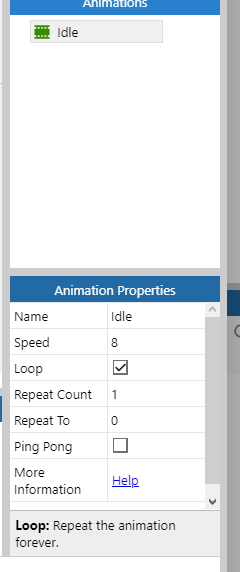

O mesmo processo deve ser aplicado para as animações


* Idle
  * Speed: 8
  * Loop: sim
* Shoot
  * Speed: 20
  * Loop: não
* Jump
  * Speed: 5
  * Loop: não
* Fall
  * Speed: 5
  * Loop: não
* Run
  * Speed: 14
  * Loop: sim


### Editando a *Collision Box*

Como adicionamos mais animações precisamos definir as caixas de colisão para elas, dessa vez faremos um trabalho mais preciso.

Segurando a tecla `ctrl` clique nos dois quadrados vermelhos acima do personagem, você vai selecionar ambos e eles ficarão amarelos, use a seta para baixo para mover a linha até a cabeça do personagem


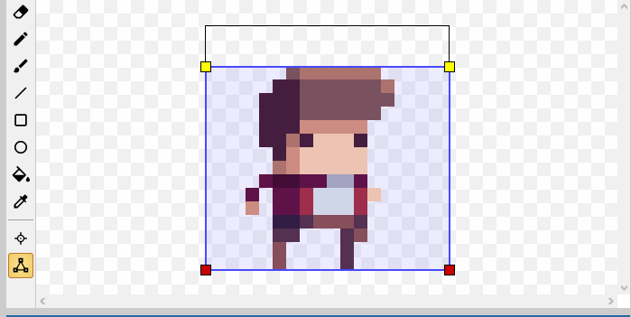
Repita o processo para os outros lados desta forma:


Agora clique no personagem com o botão esquerdo do mouse e escolha a opção `Apply to all animations`


Agora todas as animações usarão esse mesmo polígono


### Mudando a origem

Para garantir que todos os frames fiquem alinhados e para fazer o efeito de poeira saindo dos pés do personagem (que faremos logo a seguir) precisamos mudar a origem da imagem. O ponto de origem é o ponto utilizado para alinhar os frames de uma animação, vamos colocá-lo nos pés do personagem.

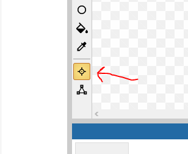


Use a opção para colocar o ponto de origem na parte de baixo da imagem


Agora aplique essa mudança para todas as animações

### Adicionando partículas

Vamos colocar um efeito de poeira quando o jogador cair no chão, para começar, adicione um novo objeto do tipo *Particles*

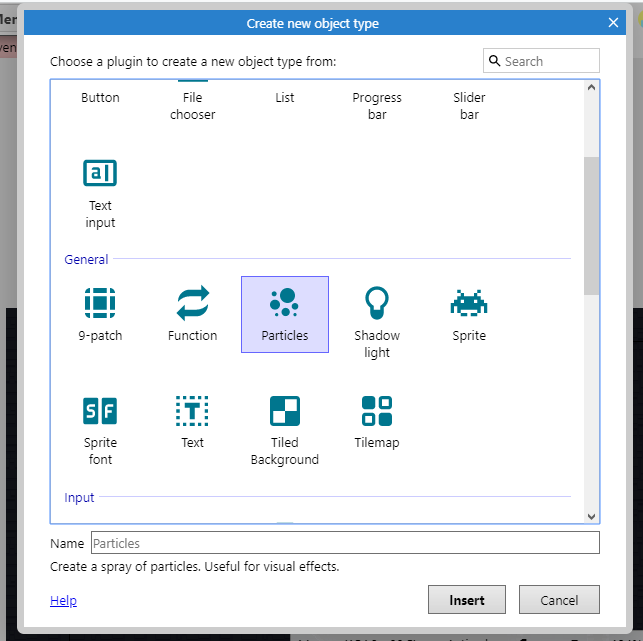

Clique na tela para adicionar o objeto, na janela que irá abrir selecione o arquivo `Particles/playerdust.png`

É importante que esse objeto esteja no jogo mas **não esteja visível** , ou seja, ele deve estar **fora do layout**, quando precisarmos dele faremos que apareça nos pés do jogador.


Renomeie o objeto para podermos programar com ele mais facilmente mais tarde


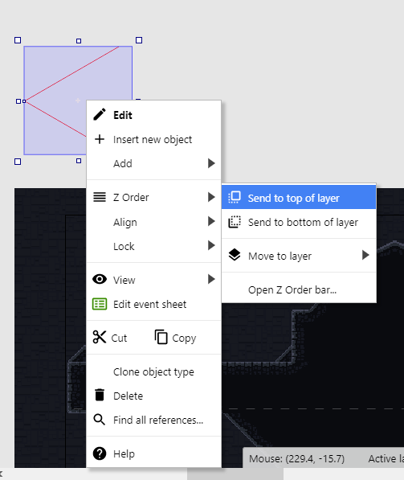

Use a opção `Z Order > Send to top of layer` para traze o objeto para o topo da camada fazendo com que efeito apareça **na frente** do personagem
Defina as propriedades conforme a seguinte imagem


## Aba Event Sheet

Nesta aba é onde ficará o código que definirá os **comportamentos do jogo** por meio de **eventos**

Um evento é uma **condição** ligada a um ou mais **objetos** do jogo, por exemplo: no game, o teclado será representado por um **objeto** do tipo **Keyboard**, pois são os **objetos** que podem lançar **eventos**, assim, podemos no código monitorar por algum **evento específico**, nesse caso, pode ser quando alguma tecla for pressionada ou solta, então podemos executar alguma ação quando esse evento ocorrer.


Alguns eventos comuns são:

* Quando algum objeto do jogo está tocando outro
  * Inimigo tocou no jogador: tirar pontos de vida do jogador
  * Jogador tocou em uma moeda: faça a moeda sumir e adicione na pontuação do jogador
* Quando o jogador está andando, pulando ou parado
  * Mude para a animação correspondente


**Lembre-se:**

1. Um evento é qualquer acontecimento dentro do jogo
2. Posso criar um código que é ativado quando um evento ocorrer
3. Posso decidir quais ações devem acontecer quando esse evento for acionado

Você pode criar um evento clicando em `Add event`


Será te perguntado a **condição**, ela tem que estar relacionada a um dos **objetos** do jogo


Uma lista de **eventos** daquele **objeto** aparecerá, você pode escolher qual deles você quer monitorar


Existem dois tipos de eventos

* Eventos que **não começam** com `On`
  * As **ações** serão executadas **enquanto** a **condição** for verdadeira
  * Se a ação for fazer o personagem pular, ele irá pular **repetidamente** até você soltar a tecla
* Eventos que **começam** com `On`
  * As **ações** são executadas na **primeira vez** que a ação for verdadeira, ou seja, apenas **no instante** que o evento ocorrer
  * Se a ação for fazer o personagem pular, ele irá pular **uma vez** e só pulará novamente se você soltar a tecla e apertá-la novamente


### Tipos de eventos

#### Evento do tipo *AND* / E

Você pode precisar que mais de um evento esteja acontecendo ao mesmo tempo para executar algum bloco. Quando existe **mais de uma condição** e precisamos que **todas** sejam verdadeiras, usamos o *AND*

Inserindo uma nova condição

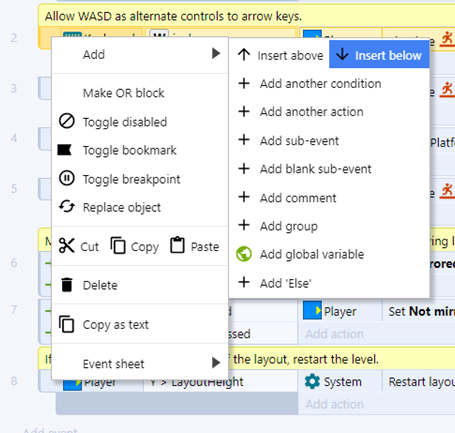


Outra forma de fazer isso


Um bloco do tipo *AND* fica dessa forma


#### Evento do tipo *OR* / *OU*


Num evento do tipo *OR* , o bloco é executado quando **uma ou mais** condições são verdadeiras.

Para fazer um bloco *OR* você precisa começar por um do tipo *AND* e usar a opção `Make OR block`


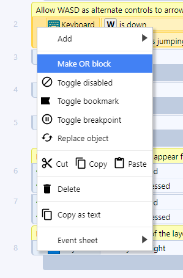


Ele ficará assim:


Você pode torná-lo um bloco *AND* usando a seguinte opção:


#### Invert

Caso você queira que o bloco **seja executado** quando uma condição **não** for verdadeira, use a opção *invert*


Um bloco com um invert fica assim:


Perceba que na imagem existe uma junção do bloco *AND* com o *invert* nesse caso, você pode ler essa condição como:


*"Execute as ações a seguir **se** A tecla *W* do teclado estiver sendo apertada **E** o player **Não** estiver pulando"*


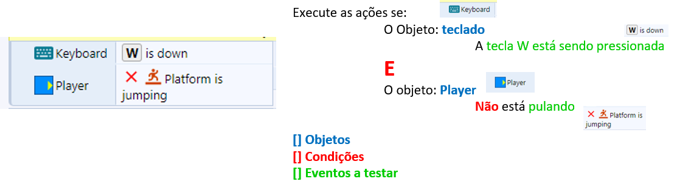


#### *Else* (Senão)

Um bloco do tipo *else* é executado quando o que foi testado em um evento não ocorreu: você pode fazer o teste de algo e o seu inverso em um mesmo bloco.


Um bloco else é criado dessa forma:


O resultado será:


Você pode ler o *else* como: *Execute essa ação se algo acontecer, **caso contrário** execute outra ação*


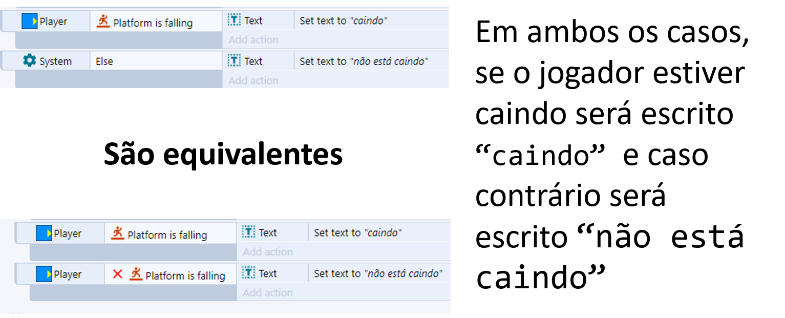


#### Subeventos

Subeventos são maneiras de condesar o código e evitar repetição. imagine que você tem que programar o seguinte:


*Se o jogador encostar numa alavanca um som deve ser tocado, se ele apertar a tecla `x` a alavanca deve mudar de posição*


Sem o uso de sub eventos a solução poderia ser assim:


```
SE (jogador está encostando na alavanca):
	toque o som
SE (jogador está encostado na alavanca E a tecla x está sendo apertada):
	mude a posição da alavanca
```


Veja que uma das condições se repete, podemos  condensar isso usando um subevento da seguinte forma:


```
SE (jogador está encostando na alavanca):
	toque o som
	SE (tecla x está sendo apertada):
		mude a posição da alavanca
```


Para criar um subevento use:


# Começando a programação


Primeiramente, vamos criar um grupo para conter os movimentos do jogador, isso será importante pois precisaremos desativar todos os movimentos na hora do jogador atirar a flecha


Como vamos adicionar os eventos ao grupo *Player Movement*, precisamos usar a opção `Add event to 'Player Movement'`


Selecione o *Player*, a condição vai ser baseada nele


Vamos começar criando o bloco onde a animação do jogador correndo será ativada quando ele estiver se movendo e estiver no chão, assim a animação de correndo não acontecerá quando o jogador estiver pulando


Se você executar o jogo agora vai ver que o jogador passa para a animação de correr quando as teclas direcionais são apertadas, mas não volta para a animação de parado. Isso não foi programado ainda...

**Dica:** agora é uma boa hora para rever a velocidade máxima que o player pode chegar e a velocidade da animação dele correndo para que os dois fiquem em sincronia.


### Fazendo o player parar


### Fazendo o player olhar para a direção correta

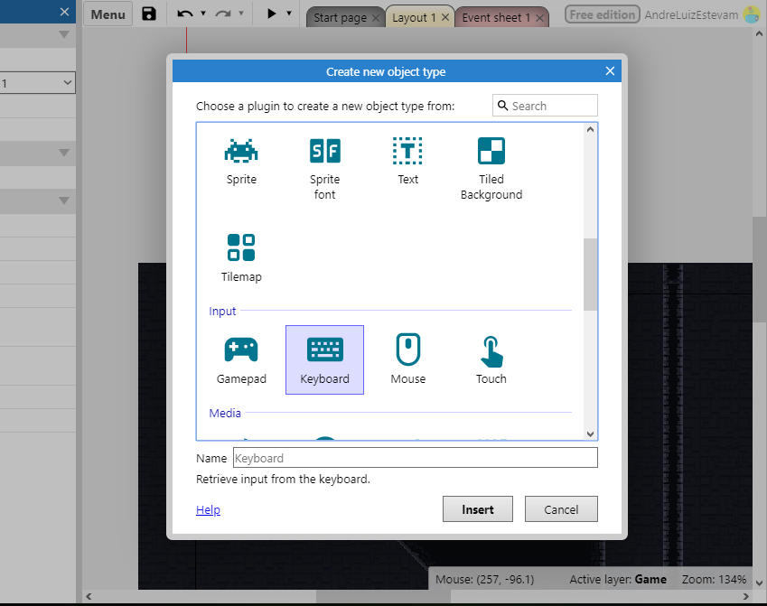

Se você não tem o Objeto *Keyboard* adicionado ao projeto, adicione-o


Crie um novo evento partindo do objeto teclado e escolha o evento `On key pressed` e aperte a seta para a esquerda para definir que queremos que código seja executado quando a tecla para a esquerda for pressionada


### Pulando, caindo e poeira


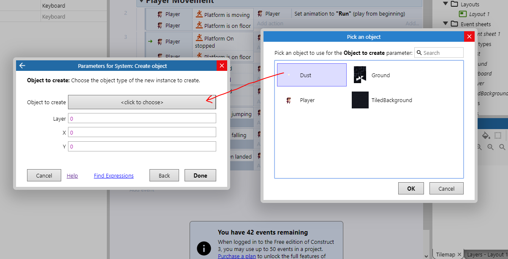


### Como o Construct executa a *event sheet*?


É preciso lembrar que, no Construct, todas as ações programadas precisam ser precedidas por um evento, pode-se dizer que, quando algo acontece no jogo um evento é disparado no código e ações são tomadas.

Mas como o jogo **sabe** que alguma ação aconteceu no jogo?

É simples, você pode enxergar a *event sheet* como uma lista de condições, o construct percorre todas elas em *loop*, testando se alguma condição é **verdadeira** se for, as ações associadas a essa condição são executadas.

O tempo para percorrer todo o código é chamado de ***tick***, é um conceito parecido com o **FPS** (*frames per second*) de um jogo ou vídeo, onde um **frame**  representa uma das **foto** instantânea em cada momento do jogo, então, mais FPS representam mais fotos por segundo, da mesma forma, em um computador mais rápido, o código é executado em menos tempo e o tempo entre um **tick** e outro é **menor** então em poucos segundos cabem **mais** ticks.


# Câmera

Nossa câmera será representada por um objeto do tipo *Sprite*, precisamos:

* Criar um novo sprite
* Pintá-lo de uma cor para que possamos vê-lo durante a programação
* Mudar seu nome para `Camera`
* Marcar em suas propriedades que quando o jogo iniciar deve ser invisível
* Fazer a programação associada


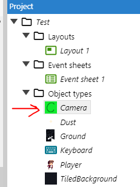


Vamos adicionar um evento do tipo `System > Every tick` **fora** do grupo `Player Movement`

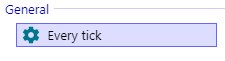


Para suavizar o movimento da câmera vamos usar a função `lerp`, ela causará um atraso no movimento da câmera num fator de `0.03`  ao ir da posição `x,y` de onde está (`Self`) até a posição `x,y` do jogador (`Player`)

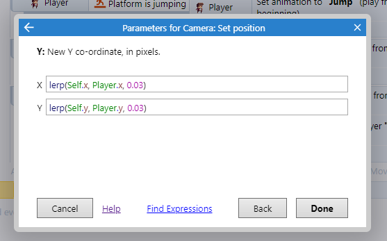


Uma função na programação funciona de maneira muito parecida com uma função na matemática, uma função é algo que:


Tem um nome e recebe um valor de entrada como:
$$
f(15)
$$


Faz algum cálculo baseado em uma fórmula:
$$
f(x) = 3x + 2
$$
E retorna algum valor como saída
$$
y = f(15) = 3 * 15 + 2
$$

$$
y = 45 + 2
$$

$$
y=47
$$


Uma forma mais simples de fazer a câmera (mas não tão boa):

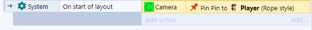


# Plataformas e Plataformas móveis

Vamos adicionar três sprites ao jogo, eles deverão receber como imagem

* `Scenario/mov1-sheet0.png` 
* `Scenario/mov5-sheet0.png`
* `Scenario/bridge-sheet0.png` 


Vamos renomeá-los da seguinte forma:


Vamos aplicar aos três o *Behavior* de `Jump Tru` que fará com que o personagem possa ficar em cima deles, mas que ao pular por baixo os atravesse.


É importante também ter as caixas de colisão feitas para que o personagem possa andar na plataforma


Obs.: aqui existe um caso especial qm que precisamos colocar a caixa de colisão um pouco abaixo da imagem, caso contrário o jogador aparecerá flutuando na base.


Agora vamos fazer com que o objeto `MovingPlatform` se torne uma plataforma que se move. Adicione o comportamento `Sine`


Configure-o da seguinte forma


Você pode alterar esses valores para ter o efeito desejado, 

* mude a direção em `Movement: Horizontal`ou `Vertical`
* Use o atributo `Period` para alterar o **período** do movimento, isto é, o tempo de cada ciclo
* Use o atributo `Magnitude` para alterar o **tamanho** do movimento


Dependendo do efeito que quiser passar você pode mudar o tipo da onda em `Wave`


* `Sine`: acelera no meio do movimento e desacelera quando vai mudar de direção
* `Triangle`: permanece com a mesma velocidade, sem desacelerar para mudar a direção
* `Square`: irá aparecer e desaparecer nas pontas de onde o movimento ocorre
* `Sawtooth` e `Reverse Sawthooth`: vai para a direita (ou esquerda), some e volta a origem


**Dica:** na hora de posicionar a plataforma que se movimenta no layout, coloque-a no **meio** da área que deve cobrir com o movimento

**Dica:** depois de ter todas as plataformas prontas você pode criar uma cópia facilmente clicando e arrastando uma plataforma pronta enquanto segura a tecla `crtl`


# Colecionáveis

## Parte visual

Crie um objeto do tipo *Sprite* para representar as moedas, crie duas animações com base nas imagens em `Items\Coin_spin` e `Items\Coin_shine`


 


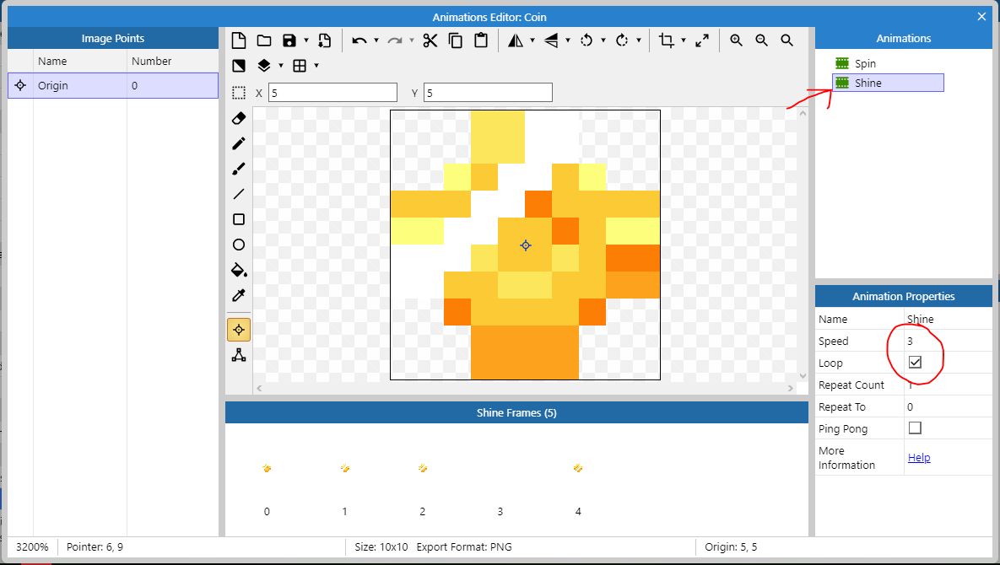


Você pode usar a mesma técnica para duplicar objetos ensinada antes e definir qual vai ser a animação que deve ocorrer na moeda da seguinte forma:


## Parte Lógica

O primeiro passo é criar uma variável de instância ao Player. Uma variável de instância é um campo que nos permite guardar um valor como um número ou um texto junto com algum objeto, nesse caso o objeto *Player*


Nosso objetivo é criar esse bloco:


Para a primeira linha escolha `Coin > Destroy`

Para a segunda use o `Player > Add to` conforme as imagens


Agora vamos criar uma variável global para guardar a quantidade total de moedas


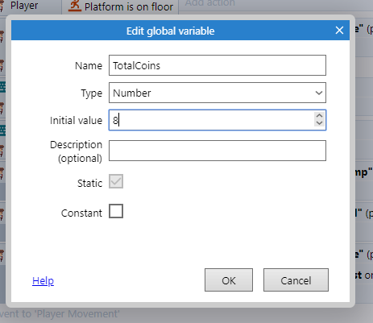


Você pode querer colocar o efeito de física na moeda, com ele é possível fazê-la interagir com as flechas que o jogador vai lançar e colocar o efeito delas sendo "sugadas" em direção ao jogador quando ele se aproximar delas.


Para isso você precisará:


1. Aplicar o comportamento `Physics` às moedas


2. Aplicar o comportamento de física ao cenário e garantir que a opção `Immovable` está marcada


3. Criar o seguinte bloco que fará as moedas serem atraidas para o jogador


Para isso, faça o seguinte

Crie um novo evento do tipo `System`


Escolha a opção `for each`


Escolha a opção `Coin`


No bloco criado, escolha a opção `Add another condition`


Escolha system novamente


Escolha a opção `Compare two values`


Coloque os seguintes valores


O `for each` executará esse código para cada moeda e testaremos para cada uma delas se a distância no plano cartesiano entre ela e o jogador é menor que 40 px, se for ela irá na direção dele:


Para fazer a moeda ser sugada, faremos o seguinte:


`dt` é a quantidade de ticks que o jogo tem, em computadores mais rápidos, o tick é menor, em mais lentos é maior, como a força será aplicada a cada tick, precisamos garantir que ela será a mesma para computadores mais rápidos e mais lentos, assim, com `3 * dt` fazemos com que:

* Num computador mais **lento** a ação de aplicar uma força que acontece **menos vezes** ocorra com **mais força**
* Num computador mais **rápido** a ação de aplicar uma força que acontece **mais vezes** ocorra com **menos força**


Dessa forma o efeito será o mesmo independentemente da plataforma.


## Interface com o usuário

### *Sprite Font*

Uma *Sprite Font* funciona como uma fonte no computador como *Times New Roman* ou *Arial*, mas as letras podem ser estilizadas e são armazenadas todas em um mesmo arquivo.


Crie um novo objeto do tipo *Sprite Font*


Defina como imagem o arquivo `Fonts/font30b.png` 

Não esqueça de renomear o objeto

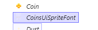

Vá nas propriedades desse objeto e deixe-as assim:


Se a configuração foi feita corretamente você conseguirá ler `0/0 COINS` no objeto, arraste-o para o topo esquerdo da tela


Se você executar o jogo agora perceberá que o texto aparece, mas que quando o personagem anda o texto sai da tela, para resolver isso precisamos criar uma nova camada para colocar a interface com o usuário.


Vamos colocar o texo nessa nova camada


Clique no nome da interface e mude o atributo parallax para `0, 0`, isso impedirá que o texto fique "vibrando" na tela


Agora vamos para a parte da programação. Esse é o resultado que queremos atingir


Para fazer isso precisamos escolher o objeto `System` e escolher a opção `Every x seconds` e definir como `0.1` segundos


Vamos escolher nas ações o objeto `CoinSpriteFont` e usar a opção `Set text`. Vamos colocar o seguinte texto: `Player.Coins & " /"& TotalCoins & " COINS"`

Esse texto irá gerar algo do tipo `5 / 10 COINS`, representando quantas moedas o jogador pegou de um total:

`Player.Coins` estamos acessando a variável de instância que colocamos no objeto player, o programa guardará nela a quantidade de moedas que o jogador pegou.

`TotalCoins` é uma variável global, ela não está em nenhum objeto do jogo, por isso não precisamos colocar algo como `Player.TotalCoins`

Tudo que foi colocado entre aspas `"text"` é considerado um campo de texto e não comandos ou números

O operador `&` é chamado de **operador de concatenação** ele consegue **juntar** os campos de texto com os **valores numéricos** nas variáveis que referenciamos


# *Checkpoint*s

*Checkpoints* são locais onde o jogador pode renascer caso tenha morrido, assim ele não perderá o progresso que fez no jogo até aquele ponto.

Nossos *checkpoints* serão representados por tochas que podem ser acendidas ou apagadas. Uma tocha acendida indica que o jogador já passou por aquele *checkpoint* e uma tocha apagada indica que ainda não passou. Vamos dar a ideia de que o jogador está acendendo as tochas ao tocar nelas.

Por fim, quando o jogador morrer, deverá reaparecer na **última** tocha que acendeu.


Vamos começar pela parte visual, precisaremos de três arquivos, dois deles serão objetos do tipo *Sprite* (a tocha e a luz ao redor dela) e um dele será um objeto do tipo *Particles* (o fogo)


Vamos adicionar a tocha, adicione um novo objeto do tipo `Sprite` e coloque a imagem que está no arquivo `Scenario/torch-sheet0.png` 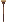

Nós iremos fazer partículas que representam fogo aparecerem no topo da tocha, para isso usaremos o ponto de origem, por isso, precisamos deslocá-lo para o topo da imagem, A forma mais simples de fazer isso é indo no menu de edição dos pontos, clicar com o botão direito do moude em `Origin` e escolhendo a opção `Quick Assign > Top`


Defina o nome desse objeto como `Torch`


Vamos adicionar uma **variável de instância** ligada a cada tocha, ela indicará se a tocha está acesa ou apagada, seu nome será `Activated`


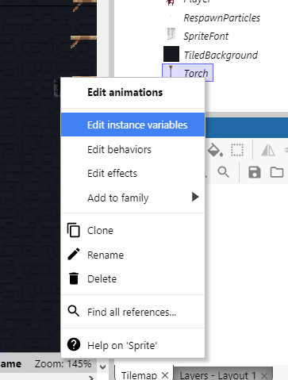


Clique na opção `Add new instance variable`, coloque o nome para a variável e defina o tipo como `Boolean`


Agora vamos adicionar um outro objeto do tipo `Sprite` para fazer o efeito de iluminação, use a imagem em `Visual Effects\light-sheet0.png`

Defina o nome desse objeto como `LightEffect`

Nela vamos aplicar alguns comportamentos e efeitos:


Os comportamentos `Sine` e `Fade`, o primeiro dará uma ondulação na quantidade de luz e o segundo tornará possível que façamos um efeito de *fade-in* quando a luz aparecer


O efeito `Dodge` para mesclar a imagem com o fundo do jogo


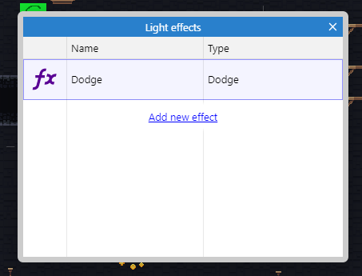


Nas propriedades, as seguintes alterações devem ser feitas

No comportamento `Sine`:


No comportamento `Fade`:


Agora adicione um novo objeto do tipo `Particles`, ele deverá se chamar `FireParticles`. Encontre a imagem para o objeto em `Particles/col_fire.png` 

Vá nas propriedades dele e coloque o seguinte:


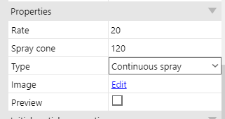


Apenas a imagem da tocha deve ser mostrada no jogo, as outras **devem estar no layout** mas **fora** da área que o usuário pode ver.


Vamos fazer a parte da programação. Primeiramente precisamos criar duas variáveis globais do tipo `number`, `CheckpointX` e `CheckpointY` elas armazenarão a posição X,Y do último *checkpoint* que o jogador ativou permitindo que ele renasça lá caso morra.


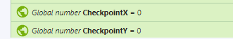


Agora faremos com que quando o jogador tocar em uma tocha que não foi ativada ainda ela seja marcada como novo checkpoint e comece a queimar.


Esse código deve fazer:

*Quando o jogador encostar em uma tocha **e** essa tocha não estiver ativada:*

1. *Crie o efeito de luz no ponto de origem da tocha* (ele será criado com um efeito de fade e no topo da tocha, já que colocamos lá o ponto de origem)
2. *Crie as partículas que fazem o fogo ponto de origem da tocha*
3. *Troque o estado da tocha para ativada* (se não fizermos isso mais fogo e mais efeitos de luz serão criados por cima dessa tocha quando o jogador tocar nela novamente)
4. *Defina a variável global `CheckpointX` para a posição `X` da tocha que o jogador acabou de encostar*
5. *Defina a variável global `CheckpointY` para a posição `Y` da tocha que o jogador acabou de encostar*


Quando você fizer isso e executar verá que, no jogo, as tochas que o jogador tocar se acenderão. Mas temos um problema, onde o jogador deve renascer caso ele morra antes de tocar em qualquer tocha? Vamos fazer com que a tocha mais próxima dele seja o checkpoint assim que o jogo começar, então lembre-se de colocar uma tocha ao lado dele no seu cenário, caso contrário o jogador pode se matar no começo do jogo para aparecer num checkpoint distante.


As condições são:

*Quando o layout começar, pegue o objeto Torch mais próximo da posição X,Y do jogador*

O código a executar é exatamente o mesmo do bloco anterior, você pode copiar e colar. Você perceberá que a tocha mais próxima do jogador será acesa sozinha ao iniciar o jogo.


Agora precisamos introduzir alguma forma do jogador morrer para testarmos se os checkpoints funcionam, faremos com que o jogador morra caso caia fora do cenário.


Vamos adicionar um efeito visual quando o jogador renascer, precisamos criar um novo objeto do tipo `Particles` com a imagem `Particles/torch_fireyellow.png`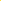 com o nome `RespawnParticles`


As propriedades devem ser as seguintes:


O programa deverá ser o seguinte:


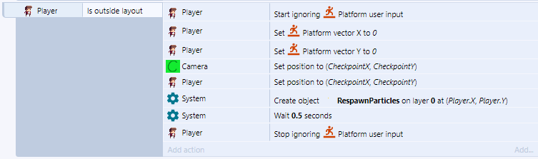


*Quando o jogador estiver fora do layout*

1. *Ativar a opção de ignorar os comandos de movimento* (Evita que o jogador se mova enquanto está caindo ou logo após renascer)
2. *Defina o vetor de velocidade no eixo X como 0* (Evita que o jogador caia muito rapidamente ao renascer)
3. *Defina o vetor de velocidade no eixo Y como 0* (Evita que o jogador ande para os lados ao renascer caso tenha morrido correndo)
4. *Mova a câmera para o checkpoint*
5. *Mova o jogador para o checkpoint*
6. *Crie o objeto `RespawnParticles` aonde o jogador está*
7. *Espere meio segundo*
8. *Permita que o jogador se mova*


Note que o personagem deve morrer quando cair para fora do layout, isso inclui

* Pular e cair infinitamente
* Ir até o fim do jogo para a direita ou para a esquerda
* Pular muito alto (ultrapassando o fim do layout)


Por isso, é necessário que você impeça ele de pular muito alto adicionando um teto ao jogo, caso contrário ele pode morrer por pular para fora do cenário. Uma outra alternativa é deixar o fim do jogo bem alto de forma que se o jogador escalar no ponto mais alto do jogo e pular, ainda não alcançará o fim do layout


**Dica:**


Clique na parte cinza (fora de qualquer objeto), na aba de propriedades serão mostradas as propriedades do projeto como um todo, marque a opção `Show Grid`, `Snap to Grid` e defina `Grid size` como `16x16` (ou o tamanho dependendo do projeto, normalmente `16x16`, `32x32`, `64x64` ou `128x128`)


Caso ache interessante, pode ativar a opção `Show Collision Polygons` que mostrará os polígonos de colisão dos objetos no jogo.


# Redimensionando o cenário

Agora que temos vários dos itens que irão compor o jogo, podemos começar a pensar e construir um cenário em definitivo, algumas dicas são:


* Tenha um esboço feito de antemão, com ele tente deduzir
  * A largura do cenário
  * A altura do cenário
* Quando for pintar o cenário, comece do centro esquerdo


* Sempre adicione paredes e um teto para evitar que o jogador mora por pular muito alto, por exemplo.


Para redimensionar, clique na parte cinza do layout (fora de qualquer objeto), as propriedades do projeto em si aparecerão na lateral.


Mude o atributo `Size` dependendo do tamanho do cenário que você pensou, lembre-se de que cenários muito grandes deixarão o jogo mais lento.


# Inimigos

Vamos começar a criar um inimigo simples que patrulhará uma área. Crie um novo objeto do tipo `Sprite` e crie uma animação com as imagens em `Enemy\PatrolSlimePatrol\`. O nome desse objeto deve ser `Enemy`.

Crie a caixa de colisão para ele e aplique a todos os quadros da animação


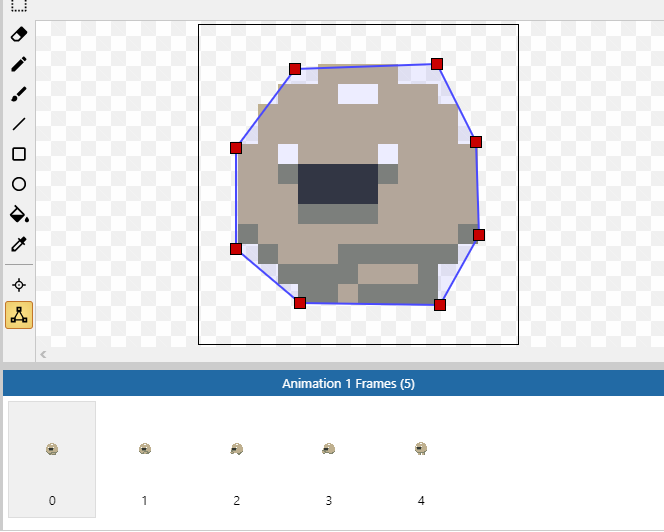

Dê um nome para a animação, defina a velocidade e marque a caixa de loop


Você precisará adicionar as seguintes variáveis de instância


A variável `Direction` será utilizada para definir a direção que o inimigo deve andar e a variável `Hitpoints` guardará a vida do inimigo.


`Direction` deverá receber o número `0` ou o número `1,` `Hitpoints` deverá receber quantos pontos de vida o inimigo vai ter contando com a força do ataque do jogador. Como quero que o inimigo morra com 3 ataques de uma arma mediana, defini este valor como `9`, cada ataque do jogador tirará `3` pontos de vida, assim, serão precisos `3` ataques.


Agora adicione mais um objeto do tipo `Sprite` e pinte-o de vermelho ou qualquer cor que se destaque.


Dê o nome de `EnemyFence`. Esse objeto definirá a área que um inimigo deve fazer sua patrulha, elas ficarão invisíveis no jogo e quando um inimigo tocar em uma delas irá passar a patrulhar no sentido oposto.


Algumas configurações no sprite `Enemy` devem ser feitas, adicione o comportamento `Platform` e defina as seguintes propriedades


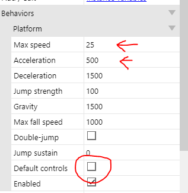

Não se esqueça de **desmarcar** a opção `Default Controls`, assim será possível controlar o movimento do inimigo pelo programa e não com o teclado.


Coloque as barreiras ao redor da área de patrulha do inimigo e vamos começar a configurar a lógica dela. Crie estes blocos:


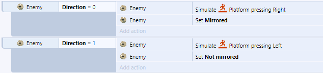

Caso a variável `Direction` seja `0` o inimigo andará para a **Direita**, caso seja `0` andará para a **Esquerda**. Precisamos fazer com que se o inimigo tocar na barreira o número em `Direction` mude de `0` para `1` ou de `1` para `0`.


Existem duas formas de fazer isso, essa é a mais simples de entender, mas gasta mais eventos.


*Quando o inimigo colidir com a barreira:*

	*Se o conteúdo em `Direction` for `0`*:
	
		*Mude o valor em `Direction` para `1`*
	
	*Caso contrário*
	
		*Mude o valor em `Direction` para `0`*

Para adicionar a condição e o *else* você precisará ir em `Add new > Sub event` 
Para adicionar a condição e o *else* você precisará ir em `Add new > Sub event` 
Para adicionar a condição e o *else* você precisará ir em `Add new > Sub event` 


Dessa forma o inimigo patrulhará entre as duas cercas. Se você quiser poupar a quantidade de eventos pode fazer o seguinte:


Na fórmula `(Enemy.Direction + 1) % 2`  estamos usando algo chamado **operação modular** não é fundamental que você a compreenda mas saiba que ela causa o mesmo resultado que a operação anterior.


Caso queira saber mais sobre o operador módulo veja:

[Khan Academy - Aritmética modular](https://pt.khanacademy.org/computing/computer-science/cryptography/modarithmetic/a/what-is-modular-arithmetic)

[TI Expert - O que é a operação módulo?](http://www.tiexpert.net/programacao/algoritmo/modulo.php)


# Sistema de vidas

Nesse jogo o jogador terá 3 vidas, vamos representá-las por uma barra de corações da seguinte forma:


para fazer isso o primeiro passo é adicionar uma variável de instância ao Player da seguinte forma:


O nome da variável será `hitpoints` e receberá um número representando a quantidade de vidas que o jogador tem, nesse caso, `3`.


Vamos adicionar a barra de vida, você deve mudar de camada e selecionar a `UI`, ao clicar no nome dela tudo que for adicionado será nessa camada.


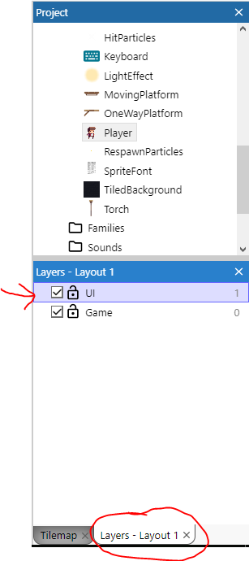


Você precisará adicionar dois objetos do tipo `TiledBackground`:

* No primeiro use a imagem em `heart-sheet1.png` e dê  o nome `LifebarEmpty`


* No segundo use a imagem em `Items/heart-sheet0.png` e dê  o nome `LifebarFilled`


Redimensione o resultado para apenas três corações aparecerem em cada imagem e sobreponha as duas da seguinte forma:


Agora, se tirarmos uns dos corações vermelhos, a imagem que está por baixo será mostrada.

Precisaremos alterar o bloco que lida com a morte do jogador:


Agora o bloco será executado quando o jogador cair da plataforma ou se tiver um número menor ou igual a zero como hitpoints, você pode estender isso adicionando algo do tipo "quando o jogador cair na lava"


Nesse caso, os hitpoints voltam a ser 3 e por conta disso a barra de vida deve voltar ao tamanho original (cada coração mede 10 pixels de largura e são 3 corações, logo, o conjunto mede 30 pixels)


Você verá mais adiante o motivo de termos de fazer isso.


No seu jogo você pode decidir o que causará a morte do jogador, por exemplo, se o jogador deve morrer ao cair na água, basta adicionar nesse bloco uma outra condição:


Um comportamento que você pode querer colocar no jogo é fazer com que o jogador perca moedas caso morra, para isso precisaremos adicionar o seguinte comando no bloco que acabamos de criar:


Precisamos da função `Player.Coins ⬅ max(Player.Coins - 5, 0)`, `max` é uma função interna do construct (assim como aquela que usamos para definir o movimento da câmera), essa função recebe dois números e retorna o maior deles, então se escrevêssemos `max(5, 20)` seria o mesmo de ter escrito `20`. Precisamos usar essa função por conta do seguinte problema: imagine que o jogador deve perder cinco moedas quando morre, nesse caso faríamos `Player.Coins ⬅ Player.Coins - 5`, mas e se o jogador tiver apenas três moedas?

Nesse caso, faríamos `Player.Coins ⬅ 3 - 5`, isso definiria as moedas como `-2`, sendo que o correto seriam `0` moedas.

Para resolver isso usamos a função `max`, um dos números é a quantia de moedas que o jogador tem subtraindo quantas vai perder e o número zero assim:


Se o jogador tiver 20 moedas e perder 5: `max((20 - 5), 0)`, como $$(20-5 = 15)$$ e $$(15 > 0)$$ o jogador fica com 15 moedas

Se o jogador tiver 1 moeda e perder 5 `max((1 - 5), 0)`, como $$(1 - 5 = -4)$$ e $$(0 > -4)$$  o jogador fica com 0 moedas e não com -4


# Coletando vidas

No nosso jogo o jogador terá três vidas, vamos incluir uma vida como um item no jogo.

Crie um novo objeto do tipo `Sprite` com o nome `Life` e com uma animação com os arquivos em `Items/HearthShine/*`


# Projéteis

No nosso jogo o personagem irá atirar flechas, existe uma animação dele atirando e a usaremos para definir quando o objeto da flecha deverá ser criado. Usaremos a seguinte lógica:


O jogador apertou o botão de atirar ⮕ A animação de puxar e atirar a flecha deve começar

Quando a animação estiver num frame específico ⮕ Uma flecha deve ser criada e configurada para ir na direção correta

Quando uma flecha for criada ⮕ Espere 4 segundos e então a destrua

Se a fecha atingir uma parede ⮕ [...]

Se a flecha atingir um inimigo ⮕ [...]


Para começar, precisamos fazer algumas configurações no jogador. Precisamos criar um novo ponto no jogador, esse ponto será onde a fecha que ele atirar será criada.


Vá ao editor de pontos, selecione a animação `Shoot` e crie um novo ponto


Dê o nome desse ponto de `Bow` 


Na imagem, arraste-o até a seguinte posição:


Use a opção de colocar o ponto na mesma posição para toda a animação com a opção `Appy to whole animation`


O resultado deverá ser o seguinte:


Aproveite para adicionar o comportamento `Flash` ao Player já que o usaremos quando ele for atingido por algum inimigo:


Agora vamos adicionar dois objetos ao jogo:

* O primeiro será do tipo `Sprite`, com o nome `Arrow` e com a imagem em `Items/arrowedited.png`
* O segundo deverá ser do tipo `Particles`, com o nome `HitParticles` e com a imagem em `Particles/hit.png`


Você deverá aplicar quatro comportamentos a flecha:


Você deverá configurá-los da seguinte forma:

**Bullet**


**Physics**


**Obs.:** Pin e Flash não tem propriedades que podem ser alteradas.


O objeto `HitParticles` deve ser configurado da seguinte forma:


Vamos para a parte da programação:


No nosso caso usaremos a tecla Z do teclado para disparar a fecha. Precisamos também que o jogador não esteja encostando em nenhuma parede já que isso causa alguns problemas.


Nós desativaremos momentaneamente o grupo `Player Movement` para evitar que a animação do jogador atirando a fecha seja sobrescrita por outra (se o jogador apertar `Z` e `→` ao mesmo tempo, a animação de atirar a flecha deve prevalecer).


Vamos ter que fazer uma pequena alteração nesse grupo para permitir que o jogador possa virar para a direita ou para a esquerda enquanto atira.

Estava assim:


Deve ficar assim:


Você deve arrastar esses dois blocos para fora do grupo:


Crie o seguinte bloco para fazer o jogo voltar ao normal quando a animação de tiro acabar


Agora crie este bloco para fazer a fecha aparecer no momento certo da animação


Caso teste o jogo, perceberá que a flecha vai apenas para um lado, para corrigir isso crie:


Vamos definir agora como as flechas irão interagir com o ambiente, você pode escolher entre três opções:

1. **Uma flecha atirada deverá ficar fincada na parede em que bateu**

   

   

2. **A flecha deverá cair quando bater em uma parede**

   

   


Você pode remover a propriedade riscada ou usar a opção `Toggle disabled`


3. **A flecha deverá ricochetear ao bater numa parede**


Como o jogo ficará lento caso muitas flechas existam ao mesmo tempo, vamos destruí-las depois de 4 segundos, no último segundo ela começará a piscar indicando que vai sumir:


Configuramos o que deve acontecer caso a fecha bata no cenário, agora vamos configurar o que deve ocorrer quando ela bata num inimigo.

Devemos prender a flecha no inimigo e tirar pontos de vida dele:


Vamos ampliar o bloco que acabamos de fazer para incluir o que deve ocorrer quando um inimigo morrer (visto que ele morre quando uma flecha bate nele)


Nessa adição vamos testar se os `Hitpoints` são `0`, criar 3 moedas e aplicar uma força aleatória para dar um efeito de "explosão".


A função `random(a, b)` recebe dois números e retorna um número aleatório entre eles, por exemplo, se fizer `random(5, 7)` a cada chamada será retornado algo como `5.3`, `6.9`, `7.0` etc.


No caso de suas moedas não terem física, simplesmente não coloque a linha que envolve a explosão.


Já programamos a morte do inimigo pelo jogador, precisamos fazer o inverso agora:


# Sons

Uma parte muito importante de um jogo é o som, no nosso jogo vamos adicionar um objeto do tipo `Audio` para poder tocar sons:


## Onde baixar


Agora você precisará encontrar sons para colocar no jogo, existem vários sites que disponibilizam sons gratuitamente, mas são em inglês, você precisará traduzir o termo que quer procurar. Tente buscar sons nos sites (listados por ordem de qualidade):


- [freesound.org](https://freesound.org/)
  - Requer cadastro para baixar
  - Tem tanto efeitos comuns como sons de jogos
  - Tem músicas
- [opengameart.com](https://opengameart.org/art-search-advanced?keys=sound&title=&field_art_tags_tid_op=or&field_art_tags_tid=&name=&field_art_type_tid%5B%5D=12&field_art_type_tid%5B%5D=13&field_art_licenses_tid%5B%5D=17981&field_art_licenses_tid%5B%5D=2&field_art_licenses_tid%5B%5D=17982&field_art_licenses_tid%5B%5D=3&field_art_licenses_tid%5B%5D=6&field_art_licenses_tid%5B%5D=5&field_art_licenses_tid%5B%5D=10310&field_art_licenses_tid%5B%5D=4&field_art_licenses_tid%5B%5D=8&field_art_licenses_tid%5B%5D=7&sort_by=score&sort_order=DESC&items_per_page=24&Collection=)
  - Não requer cadastro para baixar
  - Tem apenas efeitos para jogos
  - Tem músicas
- [noiseforfun.com](http://www.noiseforfun.com/browse-sound-effects/)
  - Não requer cadastro para baixar
  - Tem apenas efeitos para jogos
- [freesfx.co.uk](http://www.freesfx.co.uk)
  - Não requer cadastro para baixar
  - Tem efeitos e músicas comuns e para jogos
- [incompetech.com](http://incompetech.com/music/)
  - Não requer cadastro para baixar
  - Tem apenas músicas
- [soundjay.com](https://www.soundjay.com)
  - Não requer cadastro para baixar
  - Tem efeitos e músicas comuns


## Importando sons

É recomendável que você pense em uma estrutura para o nome dos sons, por exemplo, para os seguintes sons, os seguintes nomes de arquivos são interessantes:

* Som do jogador pulando: `player_jump` ou `jogador_pulo`
* Som do jogador caindo: `player_fall` ou `jogador_caindo`
* Som do jogador andando: `player_walk` ou `jogador_andando`
* Segundo som do jogador andando: `player_walk2` ou `jogador_andando2`
* Som de espada atacando: `sword_attak` ou `espada_ataque`
* Som do inimigo gritando: `enemy_scream`  ou `inimigo_grito`
* Segundo som do inimigo gritando: `enemy_scream2`  ou `inimigo_grito2`
* Terceiro som do inimigo gritando: `enemy_scream3`  ou `inimigo_grito3`
* Som do inimigo pulando: `enemy_jump` ou `inimigo_pulo`


Usando os nomes dessa forma você conseguirá localizar os sons mais facilmente no construct


Com seus sons baixados e nomeados faça o seguinte para adicioná-los ao construct:


Espere os sons carregarem e o botão `Import` ser liberado, então clique nele


## Estruturas comuns


# Dicas e solução de problemas

## Mudanças no cenário

Se você tentou **mudar o cenário** e não conseguiu, verifique se o desenho do cadeado está marcado como fechado e clique para marca-lo como aberto, cadeado fechado indica que a camada não pode ser editada


Se você percebeu que o cenário que estava fazendo **desapareceu**, verifique se a caixa de checagem antes do cadeado está desmarcada, caixas desmarcadas indicam que o que estiver naquela camada não deve ser mostrado na tela


## Menus sumiram

Se você perceber que algum dos menus citados anteriormente desapareceu, o coloque de volta usando o menu `menu > View > Bars`


você perceberá que caso clique em um menu faltante (tirando os três últimos da lista que estão disponíveis apenas na versão paga do Construct) ele aparecerá na tela, você pode arrasta-lo para a posição que desejar.


## Nomeando objetos


Sempre renomeie os objetos do jogo para o que eles representam, isso será muito útil e facilitará seu trabalho na hora da programação.

Use `F2` com o mouse sob o campo que quer editar ou use a ferramenta de renomear


## Teclas de atalho e uso do mouse

* Use a tecla `F11` para colocar ou tirar a ferramenta da tela cheia
* Use `shift + roda do mouse` para dar zoom no cenário
* `Aperte a roda do mouse e arraste` ou `espaço + arrastar o mouse `para se mover pelo cenário
* Use a tecla `F2` com o mouse em cima de um campo de **texto** para editá-lo
* `roda do mouse` para se mover na **vertical**
* `shift + roda do mouse` para se mover na **horizontal**
* `ctrl + e` para ir ao **event sheet**
* `ctrl + l` para ir ao **layout**


## Abas sumiram

Caso as abas **Layout** ou **Event Sheet** desapareçam, use este menu para abri-las novamente, você pode dar um clique duplo ou usar o botão direito do mouse.


## Layout


* Ao mudar o tamanho de objetos, você pode apertar Shift e arrastar o mouse clicando em uma das abas para mudar o tamanho do objeto sem fazer com que ele seja distorcido

* Na hora de posicionar a plataforma que se movimenta no layout, coloque-a no **meio** da área que deve cobrir com o movimento

  *Depois de ter todas as plataformas prontas você pode criar uma cópia facilmente clicando e arrastando uma plataforma pronta enquanto segura a tecla `crtl`


## Propriedades do projeto

Clique na parte cinza (fora de qualquer objeto), na aba de propriedades serão mostradas as propriedades do projeto como um todo, marque a opção `Show Grid`, `Snap to Grid` e defina `Grid size` como `16x16` (ou o tamanho dependendo do projeto, normalmente `16x16`, `32x32`, `64x64` ou `128x128`)


Caso ache interessante, pode ativar a opção `Show Collision Polygons` que mostrará os polígonos de colisão dos objetos no jogo.


## Criação do cenário

 Tenha um esboço feito de antemão, com ele tente deduzir
  * A largura do cenário
  * A altura do cenário
* Quando for pintar o cenário, comece do centro esquerdo


* Sempre adicione paredes e um teto para evitar que o jogador mora por pular muito alto, por exemplo.


Para redimensionar, clique na parte cinza do layout (fora de qualquer objeto), as propriedades do projeto em si aparecerão na lateral.


Mude o atributo `Size` dependendo do tamanho do cenário que você pensou, lembre-se de que cenários muito grandes deixarão o jogo mais lento.


## Dicas de programação

Na programação, o ponto `.` é utilizado para separar dezenas de centenas e a vírgula `,` é utilizada para sperarar números:


| Na matemática  | Na programação |
| -------------- | -------------- |
| $$15,3; 17,5$$ | `15.3, 17.5`   |


Na programação uma função é algo com um **nome** que recebe **valores** faz um cálculo e devolve um valor. Quando você chamar uma função, pense que está colocando naquele lugar o valor que ela irá retornar:


| Função                    | Descrição                                                    | Equivale a   |
| ------------------------- | ------------------------------------------------------------ | ------------ |
| `max(50.5, 6.5)`          | Retorna o maior entre dois números                           | `50.5`       |
| `int(7.5)`                | Retorna a parte inteira de um número com vírgula             | `7`          |
| ` distance(5, 7, 10, 20)` | Recebe dois pontos no plano cartesiano e retorna a distância entre eles (euclidiana) | ` 13.928388` |


# Links

https://ezgif.com/sprite-cutter

http://arcade.photonstorm.com

https://td2tl.com/scirra-store/spe12/

https://freesound.org

https://www.scirra.com/manual/126/system-expressions