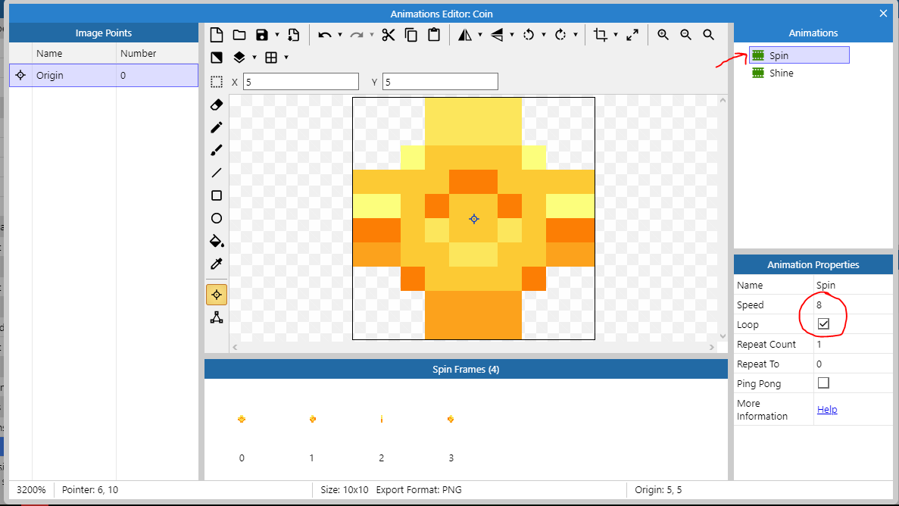
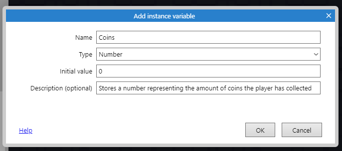
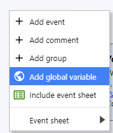

# Aula 3 - Colecionáveis, camadas e interface

[TOC]

# Colecionáveis

## Parte visual

Crie um objeto do tipo *Sprite* para representar as moedas, crie duas animações com base nas imagens em `Items\Coin_spin` e `Items\Coin_shine`

 

Você pode usar a mesma técnica para duplicar objetos ensinada antes e definir qual vai ser a animação que deve ocorrer na moeda da seguinte forma:

## Parte Lógica

O primeiro passo é criar uma variável de instância ao Player. Uma variável de instância é um campo que nos permite guardar um valor como um número ou um texto junto com algum objeto, nesse caso o objeto *Player*

Nosso objetivo é criar esse bloco:

Para a primeira linha escolha `Coin > Destroy`

Para a segunda use o `Player > Add to` conforme as imagens

Agora vamos criar uma variável global para guardar a quantidade total de moedas

Você pode querer colocar o efeito de física na moeda, com ele é possível fazê-la interagir com as flechas que o jogador vai lançar e colocar o efeito delas sendo "sugadas" em direção ao jogador quando ele se aproximar delas.

Para isso você precisará:

1. Aplicar o comportamento `Physics` às moedas

2. Aplicar o comportamento de física ao cenário e garantir que a opção `Immovable` está marcada

3. Criar o seguinte bloco que fará as moedas serem atraidas para o jogador

Para isso, faça o seguinte

Crie um novo evento do tipo `System`

Escolha a opção `for each`

Escolha a opção `Coin`

No bloco criado, escolha a opção `Add another condition`

Escolha system novamente

Escolha a opção `Compare two values`

Coloque os seguintes valores

O `for each` executará esse código para cada moeda e testaremos para cada uma delas se a distância no plano cartesiano entre ela e o jogador é menor que 40 px, se for ela irá na direção dele:

Para fazer a moeda ser sugada, faremos o seguinte:

`dt` é a quantidade de ticks que o jogo tem, em computadores mais rápidos, o tick é menor, em mais lentos é maior, como a força será aplicada a cada tick, precisamos garantir que ela será a mesma para computadores mais rápidos e mais lentos, assim, com `3 * dt` fazemos com que:

* Num computador mais **lento** a ação de aplicar uma força que acontece **menos vezes** ocorra com **mais força**
* Num computador mais **rápido** a ação de aplicar uma força que acontece **mais vezes** ocorra com **menos força**

Dessa forma o efeito será o mesmo independentemente da plataforma.

## Interface com o usuário

### *Sprite Font*

Uma *Sprite Font* funciona como uma fonte no computador como *Times New Roman* ou *Arial*, mas as letras podem ser estilizadas e são armazenadas todas em um mesmo arquivo.

Crie um novo objeto do tipo *Sprite Font*

Defina como imagem o arquivo `Fonts/font30b.png` 

Não esqueça de renomear o objeto

Vá nas propriedades desse objeto e deixe-as assim:

Se a configuração foi feita corretamente você conseguirá ler `0/0 COINS` no objeto, arraste-o para o topo esquerdo da tela

Se você executar o jogo agora perceberá que o texto aparece, mas que quando o personagem anda o texto sai da tela, para resolver isso precisamos criar uma nova camada para colocar a interface com o usuário.

Vamos colocar o texo nessa nova camada

Clique no nome da interface e mude o atributo parallax para `0, 0`, isso impedirá que o texto fique "vibrando" na tela

Agora vamos para a parte da programação. Esse é o resultado que queremos atingir

Para fazer isso precisamos escolher o objeto `System` e escolher a opção `Every x seconds` e definir como `0.1` segundos

Vamos escolher nas ações o objeto `CoinSpriteFont` e usar a opção `Set text`. Vamos colocar o seguinte texto: `Player.Coins & " /"& TotalCoins & " COINS"`

Esse texto irá gerar algo do tipo `5 / 10 COINS`, representando quantas moedas o jogador pegou de um total:

`Player.Coins` estamos acessando a variável de instância que colocamos no objeto player, o programa guardará nela a quantidade de moedas que o jogador pegou.

`TotalCoins` é uma variável global, ela não está em nenhum objeto do jogo, por isso não precisamos colocar algo como `Player.TotalCoins`

Tudo que foi colocado entre aspas `"text"` é considerado um campo de texto e não comandos ou números

O operador `&` é chamado de **operador de concatenação** ele consegue **juntar** os campos de texto com os **valores numéricos** nas variáveis que referenciamos

