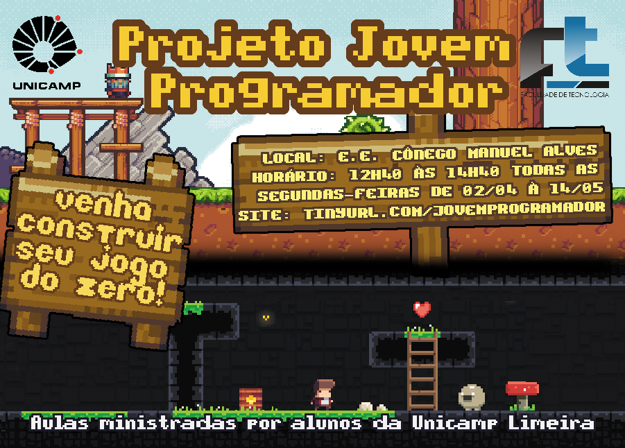

# Projeto Jovem programador

## Aulas

* [**Aula 1**](files/aulas/aula1.html)
  * [Apresentação Cotil](files/pdf/apresentacao_do_cotil.pdf)
  * [Arquivo: Aula1.c3p](files\projects\Aula1.c3p)
* [**Aula 2**](files/aulas/aula2.html)
  * [Arquivo: projeto na aula 2](files\projects\Aula2_arq1.c3p)
  * [Arquivo: projeto na aula 2 (com correções)](files\projects\Aula2_arq2.c3p)
* [**Aula 3**](files/aulas/aula3.html)
* [**Aula 4**](files/aulas/aula4.html)
* [**Aula 5**](files/aulas/aula5.html)
* [**Aula 6**](files/aulas/aula6.html)

###  Assuntos adicionais

* [1. Plataformas e Plataformas móveis](files/aulas/adicional_plataformas.html)
* [2. Mostrando moedas coletadas na interface](files/aulas/adicional_interface_1.html)
* [3. Sons, músicas e efeitos](files/aulas/adicional_sons.html)

### Funcionamento do Construct  
* [Parte Teórica](files/aulas/teorico.html)

## Material

### Arquivos
* [**Super Arcade (Arte utilizada na apostila)**](files/download/Super Arcade Texture.zip)
* [Kiwi Texture](files/download/Kiwi Texture.zip)
* [Minecraft Texture](files/download/Minecraft Texture.zip)
* [Morenie Small Texture](files/download/Morenie Small Texture.zip)
* [Morenie Texture](files/download/Morenie Texture.zip)
* [Sunny Land](files/download/Sunny Land.zip)

### Dicas
* [Dicas](files/aulas/dicas.html)

### Sites úteis

#### Construct3

* Construct3 - Acesso Online: [editor.construct.net](https://editor.construct.net)
* Construct3 - Vesão Desktop: [C3 Desktop](https://downloads.scirra.com/c3-desktop/win64/construct3-win64-c64-stable.zip)
* Expressões do sistema: [https://www.scirra.com/manual/126/system-expressions](https://www.scirra.com/manual/126/system-expressions)

## Outros sites

* [Sites de apoio](links_de_apoio.html)

